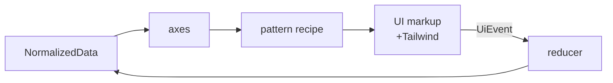

# Core Concept

데이터 흐름 + 핵심 어휘 + 합성 모델. 모든 어휘는 코드와 1:1 — 창작 없음.

## The data flow

한 방향. 양방향 바인딩·역참조·side channel 없음.



- `data` — `NormalizedData` (entities · relationships · meta)
- `axes` — `(data, currentId, trigger) → UiEvent[]`
- `patterns` — `(data, onEvent, opts?) → { rootProps, partProps(id), items }`
- `ui` — JSX + Tailwind utility class (소비자 코드)
- `reducer` — `(data, event) → next data` (`reduceWithDefaults` / `reduceWithMultiSelect`)

## NormalizedData

세 store 분리. 각 store 는 책임이 다르고, 변경 빈도가 다르다.

```ts
interface NormalizedData<E, M extends Meta> {
  entities: Record<string, E>             // user-owned: id → user data
  relationships: Record<string, string[]> // entity-keyed parent → child ids
  meta?: M                                // library-owned: focus/expanded/...
}

interface Meta {
  root?: string[]
  focus?: string | null
  expanded?: string[]
  open?: string[]
  typeahead?: { buf: string; deadline: number }
  selectAnchor?: string | null
}
```

분리 이유:

| store | 소유 | 변경 빈도 | 예 |
|---|---|---|---|
| `entities` | user | 도메인 변경마다 | `{label, disabled, selected, value, ...user}` |
| `relationships` | user | 트리 구조 변경마다 | `{folderA: ['fileA', 'fileB']}` |
| `meta` | library | 매 키 입력마다 | `focus`, `expanded`, `typeahead` |

invariants:
- `Object.keys(relationships) ⊆ Object.keys(entities)`
- top-level id 배열은 `meta.root` (entity 가 아님)
- reserved per-item flags: `selected` · `disabled` · `value` (라이브러리가 read)

builders — `fromList(items)`, `fromTree({id, children?, ...rest})`. 콜백 없음, shape transform 옵션 없음 (convention-based).

reader helpers — `getRoot`, `getFocus`, `getChildren(d, id)`, `getLabel`, `getExpanded`, `getOpen`, `isFocused`, `isSelected`, `isDisabled`, `getSelectAnchor`, `getTypeahead`.

`ROOT` sentinel — `getChildren(d, ROOT)` 이 `meta.root` 를 돌려준다. literal 로 직접 쓰지 않는다.

## UiEvent

UI ↔ headless 통신의 단일 어휘. discriminated union on `type`. `Ui` prefix 는 DOM `Event` global 충돌 회피용.

```ts
type UiEvent =
  | { type: 'navigate';   id: string }
  | { type: 'activate';   id: string }
  | { type: 'expand';     id: string; open: boolean }
  | { type: 'select';     id: string }
  | { type: 'selectMany'; ids: string[]; to?: boolean }
  | { type: 'value';      id: string; value: unknown }
  | { type: 'open';       id: string; open: boolean }
  | { type: 'typeahead';  buf: string; deadline: number }
  | { type: 'pan';        id: string; dx: number; dy: number }
  | { type: 'zoom';       id: string; cx: number; cy: number; k: number }
```

11 variant 카탈로그:

| type | 의미 | 출처 |
|---|---|---|
| `navigate` | siblings prev/next focus 이동 | Arrow / Home / End |
| `activate` | default action (Enter/Space/click) | INVARIANT A3 |
| `expand` | accordion·menu open/close | aria-expanded |
| `select` | single-select per-id | Space / click |
| `selectMany` | batch select (range/all/none) | Shift+Arrow / Ctrl+A |
| `value` | numeric value (slider/spinbutton) | numericStep axis |
| `open` | popover/menu/dialog visibility | aria-haspopup |
| `typeahead` | printable key buffer (500ms) | typeahead axis |
| `pan` | (dx, dy) translate | wheel/pointer gesture |
| `zoom` | cursor-anchored scale | wheel+ctrl gesture |

`ValueEvent<T>` — `id` 가 빠진 단일값 dispatch shape (slider/switch/spinbutton/splitter).

런타임 gate: `parseUiEvent(unknown)` zod 검증.

## Axis primitive

```ts
type Axis = (data: NormalizedData, currentId: string | null, trigger: Trigger) => UiEvent[] | null
```

- 입력: `(data, currentId, trigger)` — `Trigger = key | click`
- 출력: `UiEvent[]` (소비됨) 또는 `null` (다음 axis 로 위임)

내장 axis (`@p/headless/axes`):

| axis | 역할 | APG 출처 |
|---|---|---|
| `navigate` | siblings prev/next/start/end | role 별 키 매핑 SSOT |
| `activate` | Enter/Space/click → activate | INVARIANT A3 |
| `expand` | aria-expanded toggle | accordion/menu |
| `treeNavigate` | visible-flat (collapse 반영) | `/treeview/` |
| `treeExpand` | branch leaf 통과 + nextVisibleLeaf | `/treeview/` |
| `typeahead` | 인쇄 가능 키 → label prefix | listbox/menu/tree |
| `select` | single-select chord (Space/click) | listbox single |
| `multiSelect` | aria-multiselectable, Ctrl+A, Shift+Arrow | listbox(multi)/tree(multi) |
| `numericStep` | Arrow/Page/Home/End → value | slider/splitter/spinbutton |
| `gridNavigate` | 2D 셀 단위 ArrowLeft/Right/Up/Down | `/grid/` |
| `gridMultiSelect` | Shift+Arrow rect range | `/grid/` |
| `pageNavigate` | PageUp/PageDown N 칸 | feed |
| `escape` | Escape → `{type:'open', open:false}` | dialog/popover |

## composeAxes

```ts
const axis = composeAxes([typeahead(), navigate('vertical'), activate()])
```

- 왼쪽부터 차례로 적용
- 첫 non-null 반환을 채택 — 나머지 axis 는 단락(short-circuit)
- 각 recipe 가 자신의 axis 묶음을 정의 (`listboxAxis`, `tabsAxis`, `treeAxis`, `gridAxis`, ...) — recipe 와 axis SSOT 가 1:1

## Pattern recipe

통일 시그니처 (PATTERNS.md):

```ts
type Recipe<P extends string> = (
  data: NormalizedData,
  onEvent?: (e: UiEvent) => void,
  opts?: object,
) => {
  rootProps: HTMLAttributes        // role · aria-* · ref · onKeyDown
  items: Item[]                    // 미리 계산된 view
  [K in P]: (id: string, ...) => HTMLAttributes
}
```

규칙:
- 입력 `(data, onEvent, opts?)` — Single data interface
- 출력 `{ rootProps, <part>Props(id), items }` — `<part>` 는 ARIA `role` 그대로
- `items` 는 미리 계산된 뷰 — `data.entities[id]?.data` 손파싱 금지
- 컴포넌트 0건, JSX 0건 — props 만 반환
- stable data attrs 자동 부여: `data-selected`, `data-highlighted`, `data-open`, `data-orientation`, `data-focus-visible`

### `use*Pattern` vs `*Pattern` — 명명 규약

CLAUDE.md §2:

| 형태 | 의미 | 예 |
|---|---|---|
| `use*Pattern` | 내부에 React state (`useState`/`useRef`/`useEffect`) | `useListboxPattern`, `useTreePattern`, `useDialogPattern` |
| `*Pattern` | 순수 함수, 외부 주입만 | `switchPattern`, `sliderPattern`, `disclosurePattern` |

이름이 카테고리를 알려준다 (React `rules-of-hooks` 규약). 데이터성 state(checked/value)는 항상 외부 주입, 순수 UI 일시 state(open/timer)는 내부 캡슐화.

### Props 어휘 — role 우선

INVARIANTS 23~26:

1. **Props 이름은 ARIA `role` 그대로** — `optionProps`, `tabProps`, `rowProps`, `columnheaderProps`, `rowheaderProps`, `gridcellProps`
2. 같은 role 이 한 패턴에 여러 번 등장할 때만 APG 명사 prefix — `headerRowProps` + `rowProps`
3. 3순위는 `aria-*` 속성명 — `activeDescendantProps` (거의 미사용)
4. 라이브러리 어휘(`itemProps`·`triggerProps`·`firstRowProps`) 차용 금지

`rootProps` 예외 — 모든 패턴의 최외곽 컨테이너는 `rootProps`. 한 패턴에 distinct role outer 가 2개 이상일 때만 role-name 으로 분리 (combobox 의 `comboboxProps` + `listboxProps`).

## Reducer

```ts
type Reducer = (data: NormalizedData, event: UiEvent) => NormalizedData
```

drop-in reducers:

| reducer | 합성 |
|---|---|
| `reduceWithDefaults` | `reduce` + `singleSelect` + `setValue` |
| `reduceWithMultiSelect` | `reduce` + `multiSelectToggle` + `setValue` |

조각 reducer (필요 시 `composeReducers` 로 합성):

- `reduce` — focus/expand/open/typeahead/pan/zoom (코어)
- `singleSelect` — single-selection
- `multiSelectToggle` — `select` per-id + `selectMany` batch (O(N))
- `singleExpand` — accordion single-open invariant
- `singleCurrent` — navigation single-current
- `setValue` — numeric `value`

`composeReducers(...)` — left-to-right. 각 reducer 가 이전 출력을 본다. identity reducer (e.g. activate 에 대한 `reduce`) 가 통과시켜 다음 reducer 가 도메인 의미를 얹는다.

`applyGesture(gesture, reducer)` — gesture helper 가 활성 이벤트를 의도 이벤트 스트림으로 분해 → reducer 가 적용.

## Where Tailwind fits

CLAUDE.md invariant 4 그대로:

> **Headless behavior, Tailwind visuals.** 행동 = `@p/headless` 패턴 (`useListboxPattern`, `useToolbarPattern`, `useTreeGridPattern`, `useRovingTabIndex`…) · 시각 = Tailwind utility class. 두 축 절대 섞지 않는다.

규칙:
- Tailwind utility class 직접. 별도 토큰 wrapper 만들지 않는다
- 색은 Tailwind 기본 팔레트 (`neutral-{50..900}`, `red`, `emerald`, `blue`)
- 임의 값은 `[]` arbitrary syntax: `w-[min(100%,42rem)]`
- `aria-selected:bg-stone-900` 같은 ARIA variant 로 상태 → 시각 매핑

`@p/headless` 가 ARIA attribute 와 stable data attrs 를 부여하면, Tailwind 의 `aria-*` / `data-*` variant 가 그것을 시각으로 옮긴다 — 두 축이 만나는 단 한 지점.

```tsx
<li
  {...optionProps(item.id)}
  className="
    rounded px-2 py-1
    hover:bg-stone-100
    aria-selected:bg-stone-900 aria-selected:text-white
    data-[disabled]:opacity-50
  "
>
  {item.label}
</li>
```

행동(`optionProps` 가 부여하는 `aria-selected`·`data-disabled`)과 시각(Tailwind variant) 의 경계가 분명하다.

## 참조

- `packages/headless/src/types.ts` — `NormalizedData` · `UiEvent` SSOT
- `packages/headless/INVARIANTS.md` — 22 invariants
- `packages/headless/PATTERNS.md` — 24 recipe 시그니처
- [W3C WAI-ARIA APG](https://www.w3.org/WAI/ARIA/apg/) — 정본 어휘 출처
