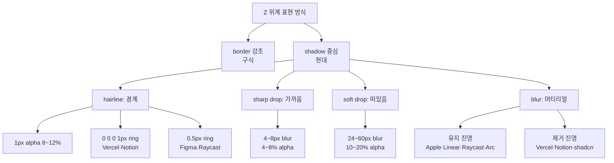

# Hairline Border + Shadow Elevation — 2024~2026 de facto

## TL;DR
업계는 **border를 지우거나 8~12% alpha hairline**까지 얇게 쓰고, 레이어 위계는 **멀티 레이어 box-shadow** (가까운 sharp + 먼 soft)로 표현하는 방향으로 수렴했다. blur는 Apple·Raycast·Linear 계열이 유지, Vercel·Notion·shadcn 계열은 제거. 공통 공식은 **`0 0 0 1px hairline` (ring) + sharp drop + soft drop + 선택적 blur**.

## Why
ds의 `surface(2)` + `--ds-shadow`는 단일 레이어 shadow + 실제 1px border로 위계를 만든다. 모달·팔레트·팝오버가 늘어나면 "얼마나 떠 있는가"를 shadow만으로 읽히게 해야 하는데, 단일 레이어로는 가까움과 떠 있음을 동시에 표현하기 어렵다. 업계 수렴 패턴을 흡수할 시점.

## How



**레이어 원리** — shadow는 "빛 1개 = 그림자 1개"가 아니다. 현실처럼 **ambient (주변광 soft) + key (직사광 sharp)** 2개 이상을 겹쳐야 물리감이 난다.

## What

### 실측 공식 (defacto)

| 진영 | 대표 | hairline | sharp drop | soft drop | blur |
|---|---|---|---|---|---|
| **Ring+Drop** | Vercel Geist | `0 0 0 1px rgba(0,0,0,.08)` | `0 4px 8px rgba(0,0,0,.04)` | `0 30px 60px rgba(0,0,0,.12)` | — |
| **Triple** | Notion popover | `0 0 0 1px rgba(15,15,15,.05)` | `0 3px 6px rgba(15,15,15,.1)` | `0 9px 24px rgba(15,15,15,.2)` | — |
| **Glass** | Raycast palette | `border 0.5px rgba(255,255,255,.1)` | `0 0 0 .5px rgba(0,0,0,.3)` | `0 10px 40px rgba(0,0,0,.5)` | `blur(30px) saturate(180%)` |
| **Glass2** | Linear menu | `1px rgba(255,255,255,.08)` | `0 4px 24px rgba(0,0,0,.2)` | `0 16px 64px rgba(0,0,0,.3)` | `blur(20px)` |
| **System** | macOS menu | `separatorColor .1` | — | `0 10px 30px rgba(0,0,0,.3)` | `NSVisualEffect menu` |
| **Tailwind** | shadow-xl | — | `0 8px 10px -6px rgba(0,0,0,.1)` | `0 20px 25px -5px rgba(0,0,0,.1)` | — |

### 다크 모드 공식
- Vercel/Linear/Notion: light alpha **× 2~3배** (예: 0.1 → 0.25~0.3)
- Material 3: shadow 대신 **surface tint 오버레이**로 밝기 증가 (대안 전략)

### elevation 토큰 네이밍 수렴
- **Tailwind**: `shadow-sm/md/lg/xl/2xl` (5단) — 가장 넓게 채택
- **Vercel**: `shadow-border/small/medium/large` (4단)
- **Material**: `elevation-1/3/6/8/12dp` (dp 수치 기반)
- **Apple**: material 이름 (`menu`, `popover`, `hudWindow`) — 의미론적

## What-if — ds 적용

현재 `src/ds/fn/values.ts`의 `surface(d)`는 `d>=2`일 때 `--ds-shadow` 하나만 붙인다. 이걸 **ring + sharp + soft 3-layer**로 확장하고, `--ds-depth`는 멀티레이어 전체에 선형 스케일을 적용하면 기존 공식과 호환된다.

```ts
// 제안 — values.ts
export const surface = (d: 0 | 1 | 2 | 3) => css`
  background-color: var(--ds-bg);
  ${d === 0 ? '' : `box-shadow: 0 0 0 1px var(--ds-hairline)${d >= 2 ? ',' : ''}`}
  ${d >= 2 ? `
    0 ${2 * d}px ${4 * d}px color-mix(in oklch, CanvasText ${2 * d}%, transparent),
    0 ${8 * d}px ${24 * d}px color-mix(in oklch, CanvasText ${4 * d}%, transparent)
  ` : ''};
`
```

- `--ds-hairline`: `color-mix(in oklch, CanvasText 8%, transparent)` (다크 자동: CanvasText가 light면 dark 쪽으로)
- `d=1`: ring만 (panel, card)
- `d=2`: ring + sharp + soft (dropdown, popover, toast)
- `d=3`: 더 강한 soft (dialog, command palette)
- `border: 1px solid`는 제거 → ring으로 일원화 (레이아웃에 1px 먹지 않는 이점)

**blur는 선택** — ds 원칙이 "투명하게 잘 보이도록"이면 Vercel/Notion 진영 (blur 없음) 정합.

## 흥미로운 이야기

- **shadcn이 popover에 `border + shadow-md`를 정답으로 굳힌 이유**: ring-only는 레티나 아닌 디스플레이에서 반 픽셀 렌더링 이슈가 있었음. Tailwind 공식 블로그에서 v3.4에 `shadow-*` 스케일을 재설계하며 border 병용을 권장.
- **Apple Liquid Glass (Tahoe 2025)**: blur 40~60px + specular highlight를 더해 "빛이 유리에 반사되는 느낌". 성능 비용이 크지만 브랜드 시그니처가 됨.
- **Material 3의 tint 전략**: dark에서 shadow가 안 보이는 문제를 shadow 강화가 아니라 **surface를 밝히는** 방향으로 풀었다. 웹 생태계는 이 전략을 거의 채택 안 함 — alpha 배수가 더 단순하기 때문.
- **Figma가 0.5px을 쓰는 이유**: 1px ring은 light bg에서 너무 강함. 0.5px은 레티나에서만 렌더되므로 의도된 "보일락말락" 효과.

## Insight

**업계 수렴 공식은 `hairline ring (8~12%) + sharp drop + soft drop`, blur는 브랜드 선택.** ds는 이미 `--ds-depth` 선형 스케일이 있어 3-layer로 확장하는 비용이 적다.

**프로젝트 규약과의 정합성**: 부분 일치.
- ✅ `Minimize choices for LLM` — 3~4단 고정 elevation은 LLM에게 덜 모호
- ✅ `Prefer de facto` — Vercel/Notion 패턴이 가장 넓게 수렴
- ✅ `Classless HTML + ARIA only` — `surface(d)`는 함수이므로 클래스 도입 없이 적용 가능
- ⚠️ 기존 `border: 1px solid`를 ring으로 치환하면 `--ds-border` 사용처 전체 영향 — 점진 치환 필요

## 출처

- [Tailwind box-shadow scale](https://tailwindcss.com/docs/box-shadow) — defacto 기준선
- [Vercel Geist Shadows](https://vercel.com/geist/shadows) — ring+drop 공식
- [Linear Redesign Blog](https://linear.app/blog/how-we-redesigned-the-linear-ui) — glass + multi-layer
- [Raycast Theme Studio](https://www.raycast.com) — 0.5px hairline + blur
- [shadcn Popover](https://ui.shadcn.com/docs/components/popover) — border+shadow-md defacto
- [Apple HIG Materials](https://developer.apple.com/design/human-interface-guidelines/materials) — 의미론적 머티리얼 네이밍
- [Material Design 3 Elevation](https://m3.material.io/styles/elevation) — tint 전략 대조군
- [Notion DevTools 실측](https://notion.so) — triple-layer 패턴
