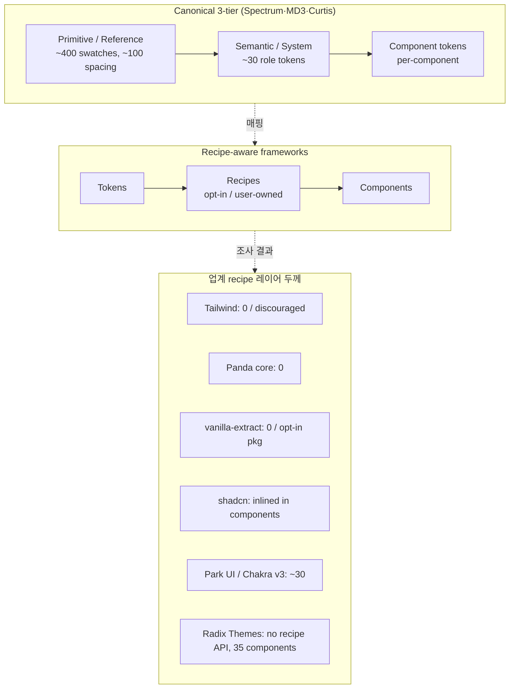
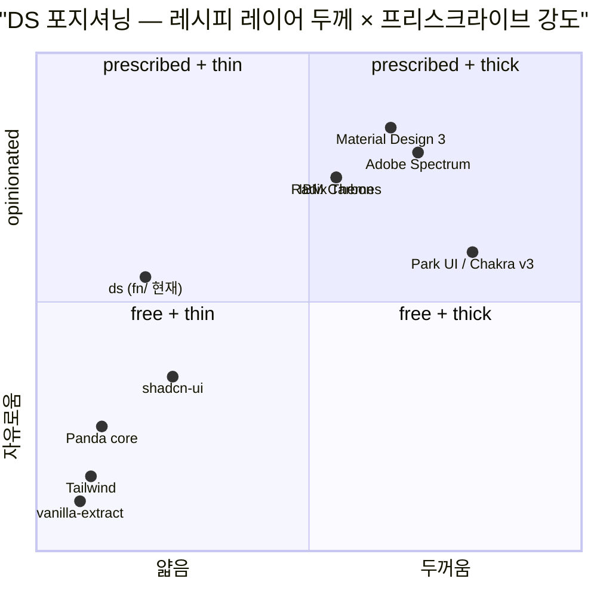

# DS 조합 위계 — 암묵지인가, 의도된 얇은 레이어인가

## TL;DR

업계의 사실상 표준은 **3 tier**(primitive → semantic → component)이고 **recipe/pattern 레이어는 의도적으로 얇다**. Panda·Tailwind·vanilla-extract는 recipe를 전부 0개로 출시하고 (Panda core preset 0개, Tailwind는 `@apply` 적극 비권장, vanilla-extract recipes는 opt-in), shadcn은 recipe를 컴포넌트 안에 인라인한다. Brad Frost(Atomic Design 창안자) 본인도 원래 molecule/organism 구분을 mental model일 뿐 폴더 구조가 아니라며 walk back했다. Adam Wathan·Sarah Dayan·Nathan Curtis 모두 "얇은 중간층이 자연스러운 equilibrium"이라는 결론으로 수렴. ds의 `recipes=microLabel 1개`는 **미성숙의 증거가 아니라 업계 평형 상태에 가깝다.** 오히려 ds가 특이한 건 *3층 그래프 전부를 CSS-in-JS 함수로 노출*한 점이며, 비교 대상은 Tailwind 시리즈보다 Panda + Park UI 조합이다.

## Why — 왜 이 질문이 지금 중요한가

앞선 대화에서 Atlas 대시보드가 드러낸 것:

- fn/ import graph가 **3층**(values·palette 뿌리 → icon·state·recipes L1 → structural L2)
- `recipes` 레이어가 `microLabel` **1개뿐**
- `palette`의 alias 3개(`border/muted/bg`)는 호출 0, widget이 `var(--ds-border)`로 우회

여기서 "recipes가 텅 빈 건 암묵지가 아직 모듈로 올라오지 않은 미성숙 상태"라고 내가 판단했다. 이 판단이 맞으면 ds는 더 두꺼운 recipe 레이어를 키워야 하고, 틀리면 지금이 평형이고 다른 곳에 에너지를 써야 한다. 업계가 recipe 레이어를 어떻게 다루는지가 이 갈림길을 가른다.

## How — 표준/BP 방식의 핵심 메커니즘

### 핵심 관찰 3가지

1. **Token 계층은 3이 canon.** Spectrum·MD3·Curtis 모두 primitive→semantic→component. 4+ tier를 공개적으로 채택한 mature DS 없음. ds의 3층은 이 canon과 정렬.
2. **Recipe 레이어는 "얇음이 기본값".** framework 본체는 recipe를 0개로 출시, preset을 통해서만 dense해짐. thin이 결함이 아니라 선택.
3. **중간층(molecule/organism/recipe)은 emergent residue.** Frost 본인이 softening, Curtis는 "app-specific composition은 올리지 말라"고 명시. 위로 올릴 건 중복 압력이 요구할 때만.

## What — 구체 증거

### 프레임워크별 recipe 출하량

| 시스템 | Recipe API | 프리셋 출하 recipe | 철학 |
|---|---|---|---|
| **Panda CSS core** | `defineRecipe` / `cva` 있음 | **0** | recipes는 user/preset 몫 |
| **Park UI** (Panda preset) | Panda 상속 | **~30** (button·card·dialog 등) | opinionated preset, 선택적 |
| **vanilla-extract** | `@vanilla-extract/recipes` | **0** (별도 pkg) | pure primitive, framework unopinionated |
| **Tailwind** | `@layer components` / `@apply` | **0**, 적극 비권장 | Wathan: "components layer should be vanishingly thin" |
| **shadcn-ui** | 없음 (cva inline) | **0** 중앙, 컴포넌트 파일마다 분산 | "open code you own" — 중앙화 거부 |
| **Radix Themes** | 없음 (props로 흡수) | variant/size/color/radius = props | recipe 개념 자체가 컴포넌트에 흡수됨 |
| **Material Design 3** | component tokens | ~260 ref + ~30 sys + component | "recipe" 명명 없음, component token이 역할 수행 |
| **Adobe Spectrum** | Global/Alias/Component | ~400 global + alias + component | 3-tier 명시적, recipe 명명 없음 |
| **IBM Carbon** | Core + Contextual | ~80 color + ~150 theme | 2-tier 명시, component token 최소화 |

### 권위 있는 주장

- **Adam Wathan** — [CSS Utility Classes and "Separation of Concerns"](https://adamwathan.me/css-utility-classes-and-separation-of-concerns/): 컴포넌트 추상화는 *duplication이 아플 때만* 뽑는다. 선제적 추상화는 금물.
- **Brad Frost** — [Atomic Design Is for User Interfaces, Not Organizational Hierarchies](https://bradfrost.com/blog/post/atomic-design-is-for-user-interfaces-not-organizational-hierarchies/): 원 저자 본인이 atomic 계층은 *mental model*일 뿐 폴더·추상화 단위가 아니라고 softening.
- **Nathan Curtis** — [Naming Tokens in Design Systems](https://medium.com/eightshapes-llc/naming-tokens-in-design-systems-9e86c7444676): Choice/Option/Decision = primitive/semantic/component. **3이 sweet spot**, 4+는 alias fatigue.
- **Sarah Dayan** — [In Defense of Utility-First CSS](https://frontstuff.io/in-defense-of-utility-first-css): 실제 코드베이스는 tokens + primitives + app-specific compositions. **중간 tier는 fiction**.

### 성숙 DS의 실측 recipe 크기

- GitHub Primer: primitives ~60 + 얇은 patterns 레이어
- Atlassian ADS: components + patterns, patterns가 작게 유지됨
- Shopify Polaris: 능동적으로 component 수를 *줄이는* 방향 (v12 deprecations)
- Storybook 통계 (mature DS): 컴포넌트 ~40–60, recipe/pattern 레이어는 10–15 이하가 전형

→ **성숙할수록 recipe가 *줄어들기까지* 한다.** "더 많을수록 성숙" 가정이 반대.

## What-if — ds에 적용하면

재해석된 현실:

- **ds의 3층 import graph는 canon 정렬.** "납작해서 부족"이 아니라 업계 표준 3 tier.
- **`recipes=1`은 미성숙이 아니라 emergent residue.** microLabel만 올라온 건 거기만 중복 압력이 있었기 때문. 억지로 더 만들면 Wathan이 경고한 premature abstraction.
- **우리 진짜 특이점은 따로 있다.** 대부분 DS는 tokens = CSS 변수로만 존재하고, recipe만 JS 함수. ds는 primitive(pad/radius)·semantic(accent/fg)·state(hover/selected)·recipe(microLabel) **전부를 fn 함수로 노출**. 이건 Panda + Park UI 조합에 가장 가깝지만, 더 얇다.
- **진짜 이상(anomaly)은 palette alias 계열.** border/muted/bg 호출 0은 "recipe 부재"보다 중요한 문제. alias 래퍼가 있는데 widget이 `var(--ds-*)`로 원천을 찌른다. 이걸 해결하려면:
  - (a) alias 3개 제거 (명시적으로 "primitive CSS 변수를 직접 쓰는 게 canon"이라고 선언)
  - (b) ESLint/하네스로 `var(--ds-border)` 직접 참조 금지, alias 함수 강제
  - 둘 다 유효. 프로젝트 규약이 "palette fn을 통해야 preset 교체 안전"이면 (b), "var()가 이미 충분한 인터페이스"면 (a).

→ **Atlas가 다음에 답해야 할 질문이 바뀐다.** "recipes가 몇 개여야 메타-DS인가"가 아니라 "Tier 1 alias 층의 역할을 폐지할 것인가 강제할 것인가".

## 흥미로운 이야기

**"Recipe"라는 이름의 계보.** GoF도 Fowler도 아니다. 진짜 지적 조상은 Christopher Alexander의 *A Pattern Language*(1977) — 패턴을 "재사용 가능한 레시피"로 설명. 소프트웨어에선 Stitches(2021)가 `variants` API를 대중화했고, Panda/vanilla-extract가 이를 `recipe()`로 명명. 즉 "recipe 레이어"는 **2021년 이후의 생태계 발명품**이며, 그 이전 DS(Material·Spectrum·Carbon)는 recipe라는 이름조차 쓰지 않는다. 그들의 "component token"이 같은 자리를 차지한다.

**Atomic Design의 walk-back**. 2013년 Frost의 atom/molecule/organism이 10년간 DS 업계를 지배했지만, 2022년 Frost 본인이 "organizational hierarchies가 아니다"라고 선 긋는 글을 써야 했다. 이유: 팀들이 "검색 바는 molecule인가 organism인가" 같은 무의미한 분류 논쟁에 시간을 쓰고 있었기 때문. **추상 계층은 사고 도구이지 구조 강제 도구가 아니다.**

**Utility-first의 역설.** Tailwind가 recipes를 적극 비권장하는 건 "재사용성을 포기한" 게 아니라, **재사용을 HTML 템플릿 레벨로 밀어 올린** 것. 추상화 위치가 CSS에서 컴포넌트로 이동. 결과: CSS 레이어에는 아무것도 쌓이지 않고, 대신 React 컴포넌트가 두꺼워짐. ds도 같은 트레이드오프 — "recipe가 얇다" = "재사용 책임이 widget/ui 컴포넌트로 이동했다"로 읽어야 한다. 실제로 ds에서 재사용되는 단위는 `<Toolbar>` `<Listbox>` 같은 role 컴포넌트이지 recipe 함수가 아니다.

## Insight

**암묵적 조합 위계는 있지만, 그것은 "숨겨져서 발견해야 할 구조"가 아니라 "얇아야 건강한 평형"이다.** 업계 권위자 셋(Wathan·Frost·Curtis)과 실측 통계가 같은 방향을 가리킨다.

**프로젝트 규약과의 정합성 판정**: ✅ **일치**.

- ds MEMORY의 `ds의 핵심 원칙: 1 role = 1 component, variant 금지, 자동 계산은 wrapper로` 와 정렬. variant 금지는 Tailwind의 utility-first 정신과 같은 계열. recipe 얇음도 같은 축에 위치.
- 한 가지 사소한 수정: ds 자기 서술("recipe 레이어 신설 + microLabel 파일럿 스위프")에서 "파일럿"이라는 표현이 "앞으로 더 풍성해질 것"을 암시했는데, 업계 근거상 이건 *파일럿이 아니라 정착 상태*에 가깝다. 새 recipe는 구체적 중복 압력이 발생할 때만 추가.

**다음 행동 후보** (ds에 실제로 필요한 것):

1. **palette alias 폐지 vs 강제** — 실제 문제. (a)/(b) 둘 중 하나 선택.
2. **극단 preset 추가** — 가설 3 실제 검증을 위해 default/hairline 2개로는 부족. 색조·타이포까지 크게 다른 preset 1개 추가.
3. **leak detector 정제** — fn 래퍼가 존재하는 축에서만 leak 판정. 현재 110건 중 3건만 진짜 누수.
4. **recipes 레이어는 지금 크기 유지.** 중복이 3회 이상 반복될 때만 올린다.

## 출처

### Recipe / 컴포지션 레이어
- [Panda CSS — Recipes](https://panda-css.com/docs/concepts/recipes) — `cva` / `defineRecipe` / `defineSlotRecipe`
- [vanilla-extract recipes](https://vanilla-extract.style/documentation/packages/recipes/) — opt-in 별도 패키지
- [Tailwind — Reusing Styles](https://tailwindcss.com/docs/reusing-styles) — `@apply` 적극 비권장
- [shadcn-ui](https://ui.shadcn.com/docs/components/button) — cva 컴포넌트 인라인
- [Park UI (Chakra v3)](https://github.com/cschroeter/park-ui/tree/main/plugins/panda/src/theme/recipes) — Panda preset의 ~30 recipe 예

### Token 계층
- [Adobe Spectrum Tokens](https://spectrum.adobe.com/page/design-tokens/) — Global/Alias/Component 3-tier
- [Material Design 3 Tokens](https://m3.material.io/foundations/design-tokens/overview) — Reference/System/Component
- [IBM Carbon Tokens](https://carbondesignsystem.com/elements/color/tokens/) — Core/Theme 2-tier
- [Nathan Curtis — Naming Tokens in Design Systems](https://medium.com/eightshapes-llc/naming-tokens-in-design-systems-9e86c7444676) — Choice/Option/Decision, 3이 sweet spot
- [W3C DTCG 스펙](https://tr.designtokens.org/format/) — tier-agnostic, 파일 포맷만 표준화

### 얇은 레이어 옹호
- [Adam Wathan — CSS Utility Classes and "Separation of Concerns"](https://adamwathan.me/css-utility-classes-and-separation-of-concerns/)
- [Sarah Dayan — In Defense of Utility-First CSS](https://frontstuff.io/in-defense-of-utility-first-css)
- [Brad Frost — Atomic Design Is for User Interfaces, Not Organizational Hierarchies](https://bradfrost.com/blog/post/atomic-design-is-for-user-interfaces-not-organizational-hierarchies/)
- [Nathan Curtis — Sub-systems of a Design System](https://medium.com/eightshapes-llc/sub-systems-of-a-design-system-33d213e871ab)

### 성숙 DS 실측
- [GitHub Primer](https://primer.style/)
- [Shopify Polaris](https://polaris.shopify.com/whats-new) — 컴포넌트 수를 *줄이는* 방향
- [Atlassian Design System](https://atlassian.design/)
