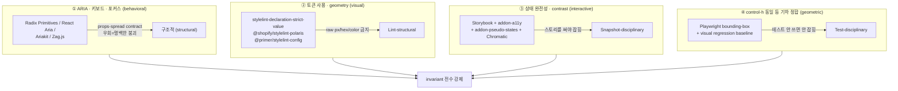
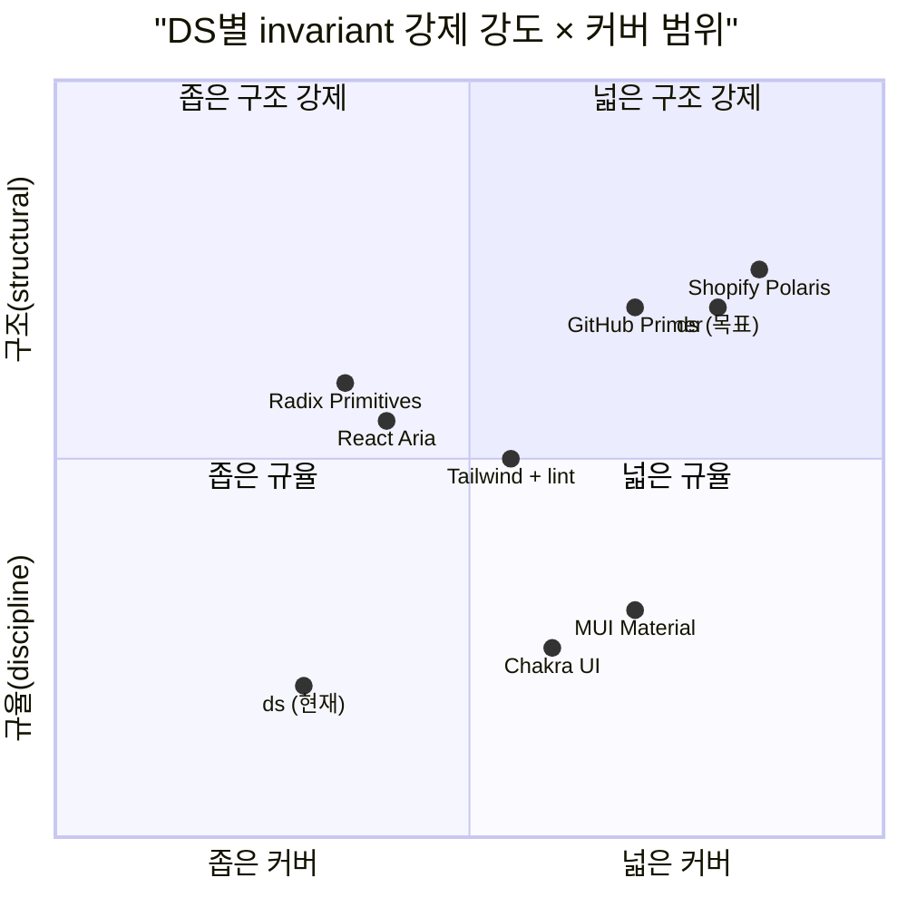

# Invariant 강제 — 업계는 "위반 불가능"을 어떻게 만드는가

## TL;DR

**업계는 invariant를 네 층위로 나눠 각각 다른 도구로 강제한다.** ARIA·키보드는 headless lib의 props-spread **구조적 계약**으로, 토큰·geometry는 **stylelint**(`stylelint-declaration-strict-value`, `@shopify/stylelint-polaris`)로, 상태·contrast는 **Storybook + pseudo-states addon + Chromatic**으로, 나머지는 **리뷰어 체크리스트**. **시각 상태 완전성(rest/hover/focus/active/disabled/selected)을 타입/컴파일로 강제하는 DS는 없다** — Radix·MUI·Chakra 전부 "override로 hover 지우기"가 가능. 가장 엄격한 곳은 **Shopify Polaris**(raw `color`/`spacing`/`radius` 리터럴을 전면 차단하는 `@shopify/stylelint-polaris`)와 **GitHub Primer**(`@primer/stylelint-config`). ds의 현재 상태는 "함수는 있고 강제는 없음" = 업계 최하위권 — 하지만 Polaris·Primer 수준으로 올리는 길은 명확하다.

## Why

앞 턴에서 **recipe 층은 얇아야 건강, 하지만 invariant 층은 우회 불가여야 건강**이라는 전환이 있었다. ds는 invariant를 이미 primitive에 encode했지만(`controlBox`=29.5px+flex center, `icon()`=정사각, `rowPadding`=수평>수직, state.ts 7종), **호출은 자율**이고 우회 감지 메커니즘 없음. 이 갭이 실제로 얼마나 심각한지, 그리고 업계가 어떤 도구로 이 갭을 닫는지 확인이 필요했다. 사용자의 지적("컨트롤 동일 크기·아이콘 middle·contrast는 무조건")은 정확히 이 축을 찔렀다.

## How — invariant 강제의 4층 메커니즘





## What — 계층별 구체 도구

### 계층 1 · ARIA/키보드/포커스 (구조적으로 강제됨)

| 라이브러리 | 메커니즘 | 우회 시 결과 |
|---|---|---|
| **Radix Primitives** | `Slot`+`asChild`, `data-state`/`data-highlighted` 속성 | spread 누락 = ARIA 붕괴, 명백히 깨짐. Runtime `React.Children.only` 어서션 |
| **React Aria** | `useButton()` → `{buttonProps, isPressed, isFocusVisible}`. spread 강제 | spread 누락 = 키보드/ARIA 붕괴. TS는 "return 타입"만 보장, spread 여부는 확인 못함 |
| **Ark UI / Zag** | XState 머신. 머신 내부 상태 전이는 **컴파일 시 전수 검증** | 하지만 DOM은 consumer 몫, 구조적 보장 경계가 머신에서 끝남 |
| **Ariakit** | `<MenuItem>` 컴포넌트 사용 시 ARIA/키보드 자동 | CSS는 여전히 consumer 몫 |

**핵심**: "headless = behavior는 구조적, visual은 규율". ds의 `state.ts`가 role 단위로 `:focus-visible`까지 공급하는 건 **헤드리스 라이브러리를 넘어선 지점**이며, Radix/RAC가 의도적으로 out-of-scope로 둔 영역을 메운다. [출처: [Radix Styling Guide](https://www.radix-ui.com/primitives/docs/guides/styling), [React Aria Building a Button](https://react-spectrum.adobe.com/blog/building-a-button-part-1.html)]

### 계층 2 · 토큰·geometry (stylelint로 구조 강제 가능)

| 도구 | 무엇을 막나 | 누가 씀 |
|---|---|---|
| **`stylelint-declaration-strict-value`** | `color`/`fill`/`font-size`/`margin`/`padding`/`z-index`에 raw 값 금지. token 변수만 허용 | 업계 표준 | 
| **`@shopify/stylelint-polaris`** | 가장 공격적. `color`/`spacing`/`radius`/`z-index`/`motion` 전부 토큰 강제 | Shopify Polaris |
| **`@primer/stylelint-config`** + **`@primer/eslint-plugin`** | hex·px 차단 + `primer-react/no-deprecated-colors` 같은 컴포넌트 룰 | GitHub |
| **`eslint-plugin-tailwindcss`** (`no-arbitrary-value`) | `w-[17px]` 차단 | Tailwind 엄격 모드 |
| **MUI / Chakra** | `theme.components` + `sx` escape hatch | lint 없음, 컨벤션 |

**핵심**: "토큰 써" = 문서가 아니라 lint 규칙으로 **강제 가능**. Polaris가 가장 엄격하고, Primer가 그 다음. MUI/Chakra는 lint 없음. [출처: [stylelint-declaration-strict-value](https://github.com/AndyOGo/stylelint-declaration-strict-value), [@shopify/stylelint-polaris](https://www.npmjs.com/package/@shopify/stylelint-polaris), [Primer stylelint-config](https://github.com/primer/stylelint-config-primer)]

Nathan Curtis: ["Tokens Gatekeeping"](https://medium.com/eightshapes-llc/tokens-in-design-systems-25dd82d58421) — "토큰은 문서가 아니라 **lint로 강제되는 계약**이어야 한다"가 이 계층의 canonical argument.

### 계층 3 · 상태 완전성 (스토리 + snapshot)

**"State completeness" is a named practice.** Canonical 목록 (Nathan Curtis + Material + Figma 수렴):

```
rest / hover / focus(-visible) / active(pressed) / disabled / selected / loading / error
```

강제 도구 체인:

1. 컨트롤마다 위 상태 각각의 **Storybook 스토리 명시적 작성**
2. **`storybook-addon-pseudo-states`** — `:hover`/`:focus-visible`/`:active` pseudo를 강제로 켜서 스크린샷 가능하게
3. **Chromatic/Percy** visual regression — baseline 대비 diff
4. **`@storybook/addon-a11y` + axe** — runtime contrast 검출

axe는 **contrast**를 runtime으로 체크하지만 **"hover 누락"은 못 잡음**. 그래서 pseudo-states addon + baseline 스토리가 필수. [출처: [storybook-addon-pseudo-states](https://storybook.js.org/addons/storybook-addon-pseudo-states), [Nathan Curtis — States in Design Systems](https://medium.com/eightshapes-llc/states-in-design-systems-f4acd0bf0b29), [Material — Interaction States](https://m3.material.io/foundations/interaction/states/overview)]

**Contrast 자동화:**
- **Adobe Leonardo** ([leonardocolor.io](https://leonardocolor.io)) — 수학적으로 target contrast ratio를 보장하는 토큰 생성
- **Radix Colors** — 12-step 스케일 각 stop의 AA/AAA 페어 문서화
- `@adobe/leonardo-contrast-colors` / `wcag-contrast` npm — CI에서 토큰 페어 검증. Primer `@primer/primitives`가 CI contrast 테스트 돌림.

### 계층 4 · control-h 동일 등 기하 정합

**lint로 불가능, test로만 가능.** Adobe Spectrum은 Playwright bounding-box 어서션: `expect(box.height).toBe(32)`. 이건 **대형 DS에서도 특별한 실천**이지 표준 아님. 대부분은 "size prop"(`size="md"` → 32px)으로 컴포넌트 API에 흡수해서 컨트롤 제작자가 값을 건드리지 못하게 함. 이건 구조적 강제 = **컴포넌트가 token을 박고, consumer는 prop만 선택**. [출처: [Adobe Spectrum button test](https://github.com/adobe/react-spectrum/blob/main/packages/%40react-spectrum/button/test/Button.test.js)]

## What-if — ds 현재 상태와 gap

### 현재 강제 수준 (계층별)

| 계층 | ds 현재 | 업계 | 판정 |
|---|---|---|---|
| ① ARIA/키보드 | `ControlProps`+`composeAxes`+`useRoving`으로 role 내부 강제 | Radix/RAC와 동급 | ✅ 구조적 |
| ② 토큰/geometry lint | `scripts/lint-ds.mjs` 있지만 raw hex/px 차단 규칙 없음 | Polaris/Primer 수준 가능 | ❌ **공백** |
| ③ 상태 완전성 | `state.ts`가 role 단위로 7상태 CSS 공급 — **규약**이지만 누락 감지 없음 | Storybook+pseudo-states+Chromatic | ❌ **공백** |
| ④ 기하 정합 (control-h) | `controlBox`로 min-height 29.5px 박음. 호출 자율 | size prop 구조화 or Playwright 테스트 | ⚠️ 부분 |

### 즉시 실행 가능한 이식 (ROI 순)

**1. stylelint 도입 (계층 2) — 1일 작업, 최대 효과**
   - `stylelint-declaration-strict-value` + 커스텀 프리셋
   - 규칙: `color`/`background-color`에 `var(--ds-*)` 이외 금지, `padding`/`margin`에 `px` 리터럴 금지 (단 `var(--ds-space)` 곱만 허용)
   - `scripts/lint-ds.mjs`를 확장하거나 stylelint로 대체
   - 이게 Atlas의 "leak report 107건 false positive" 문제도 해결. 진짜 leak과 "fn 래퍼가 없는 토큰 사용"을 구분.

**2. invariant 호출 커버리지 감사 (계층 4) — Atlas 확장**
   - 새로운 audit: "control role인데 `controlBox` 호출 없음", "clickable인데 `hover`/`focus` 호출 없음", "icon 쓰는데 `icon()` 없이 수동 크기"
   - Atlas의 "usage 배지"를 invariant 항목에선 **"coverage %"**로 재해석. 100% 미만이면 빨강.
   - `scripts/role-css-audit.ts`가 role × CSS 커버리지를 이미 보고 있음 — 확장 지점.

**3. pseudo-states 시각 증명 (계층 3) — 중간 비용**
   - `storybook-addon-pseudo-states` 도입하거나, ds만의 경량 뷰어로 role마다 7상태 스크린샷 페이지 생성
   - Atlas의 데모 카드를 "rest + 6상태" 탭으로 확장하면 Atlas 자체가 state completeness viewer가 됨. Chromatic 없이도 육안 점검 가능.

**4. contrast CI (계층 3) — 작은 비용**
   - `@adobe/leonardo-contrast-colors` 또는 `wcag-contrast` npm으로 preset 로드 시점에 `fg×bg` 페어 contrast 검증
   - 테스트가 preset 추가를 막아줌. 메타-DS 가설 3의 진짜 테스트.

### 하지 말아야 할 것

- **TypeScript로 "state 없는 Button은 컴파일 에러" 시도**: 업계 어느 DS도 성공 못함. React Aria도 못함. ROI 없음.
- **컴포넌트 API를 size prop으로 고정** (MUI 스타일): ds의 "1 role = 1 component, variant 금지" 규약과 충돌. 대신 role 자체가 `controlBox` 내장하도록 설계 — 이미 `ToolbarButton` 등은 그렇게 됨.

## 흥미로운 이야기

**"Invariant" 용어의 부재.** 업계 조사에서 Radix·RAC·Chakra·MUI 전부 "invariant"라는 단어를 docs에서 쓰지 않는다. 대신 **"contract"**(계약)이라는 말을 쓴다 — Radix와 React Aria 모두 "props-spread contract"라 부름. 그리고 이 계약은 **ARIA/키보드에 한정**이고 시각 상태는 포함하지 않는다고 명시한다. Devon Govett(React Aria 리드): *"It's up to you to render a focus ring"* — 의도적 out-of-scope 선언.

**Polaris가 가장 엄격한 이유.** Shopify는 수천 명의 파트너 개발자가 Polaris로 앱을 만든다. 파트너가 토큰을 우회하면 Shopify 브랜드 일관성이 무너진다. 즉 **enforcement 강도는 조직 규모·외부 기여자 수와 비례**한다. 1인 프로젝트에는 과잉일 수 있지만, ds가 여러 앱(finder·inspector·matrix·edu-portal-admin)에 소비되고 있다면 Polaris 모델이 적합하다.

**State completeness는 2020년대 초 정착.** Nathan Curtis의 "States in Design Systems"(2019), Material 3의 Interaction States 가이드(2021), `storybook-addon-pseudo-states`(2022). 이전에는 "focus ring은 디자이너가 알아서" 수준이었고, WCAG 2.2(2023)의 `focus-not-obscured` 추가로 법적 요구치까지 올라감. 즉 **"상태 완전성 강제"는 최신 실천**이며, ds가 여기에 일찍 투자하면 뒤처지지 않고 오히려 앞서간다.

**Tailwind는 왜 arbitrary value를 허용하나.** Wathan의 선택은 "초반 자유도 > 후반 일관성". 초기 프로토타입에 arbitrary가 필요하고, 정착 시 `no-arbitrary-value` 룰로 lock down. 즉 **invariant 강제는 프로젝트 페이즈에 따라 강도를 조정**하는 게 정석. ds가 지금 엄격하게 갈지, 아직 자유도를 남길지는 현재 페이즈(시스템 수렴 vs 탐색)에 달렸다.

## Insight

**invariant 강제의 sweet spot은 4층 중 ①②③을 구조적으로, ④는 테스트로 보는 것**. ds는 ①을 이미 headless lib 수준으로 구현했고(`ControlProps`+`useRoving`+`state.ts`), ②③④가 공백. 이 공백은 "함수가 존재하지만 호출이 자율"이라는 한 문장으로 요약된다.

**프로젝트 규약과의 정합성 판정**: ✅ **일치 (권장)**.
- ds의 `feedback_no_escape_hatches` 메모리 ("raw `role=...` 0개")는 이미 ①을 강제하는 안티패턴 훅을 함의. 같은 철학을 ②③④로 확장하면 자연스러운 연장.
- `feedback_minimize_choices_for_llm` ("variant 금지, 자동 계산은 wrapper로")도 **"LLM이 고를 선택지를 줄이자"**는 취지인데, stylelint 차단은 정확히 이 목표에 부합. raw hex/px를 금지하면 LLM이 fn 래퍼로 수렴.

**즉, ds는 철학적으로 Polaris/Primer 수준의 enforcement로 갈 준비가 이미 되어 있고, 도구만 없다.** 가장 싼 승리는 stylelint 도입(1일). 가장 큰 구조 변화는 Atlas를 "invariant coverage 뷰어"로 재정의하는 것.

**다음 행동 후보 (수정된 우선순위):**

1. **stylelint + `declaration-strict-value` 도입** — raw 값 차단, leak detector 정제 (계층 ②)
2. **Atlas v2: invariant coverage 모드** — `controlBox/icon/hover/focus/selected/disabled` 각각이 해당 role/widget에서 100% 호출되는지 체크, coverage %로 표시 (계층 ④)
3. **pseudo-states 뷰어** — role × 7상태 격자로 Atlas 데모 확장 (계층 ③ 경량판)
4. **preset contrast CI** — `wcag-contrast` npm으로 `applyPreset` 단위테스트 (계층 ③)

recipe 레이어는 이전 조사대로 **얇게 유지**. 에너지는 invariant enforcement로 몰린다.

## 출처

### Headless 계약 (계층 ①)
- [Radix Primitives — Styling](https://www.radix-ui.com/primitives/docs/guides/styling)
- [Radix Slot](https://www.radix-ui.com/primitives/docs/utilities/slot)
- [React Aria — useButton](https://react-spectrum.adobe.com/react-aria/useButton.html)
- [Devon Govett — Building a Button Part 1](https://react-spectrum.adobe.com/blog/building-a-button-part-1.html)
- [Zag.js](https://zagjs.com/overview/introduction), [Ark UI](https://ark-ui.com/docs/overview/introduction)
- [Headless UI — Menu](https://headlessui.com/react/menu)
- [Ariakit Styling](https://ariakit.org/guide/styling)

### Stylelint / 토큰 enforcement (계층 ②)
- [stylelint-declaration-strict-value](https://github.com/AndyOGo/stylelint-declaration-strict-value)
- [@shopify/stylelint-polaris](https://www.npmjs.com/package/@shopify/stylelint-polaris)
- [@primer/stylelint-config](https://github.com/primer/stylelint-config-primer)
- [@primer/eslint-plugin-primer-react rules](https://github.com/primer/react/tree/main/packages/eslint-plugin-primer-react/docs/rules)
- [eslint-plugin-tailwindcss/no-arbitrary-value](https://github.com/francoismassart/eslint-plugin-tailwindcss/blob/master/docs/rules/no-arbitrary-value.md)
- [Nathan Curtis — Tokens in Design Systems](https://medium.com/eightshapes-llc/tokens-in-design-systems-25dd82d58421)

### 상태 완전성 + contrast (계층 ③)
- [Nathan Curtis — States in Design Systems](https://medium.com/eightshapes-llc/states-in-design-systems-f4acd0bf0b29)
- [Material 3 — Interaction States](https://m3.material.io/foundations/interaction/states/overview)
- [storybook-addon-pseudo-states](https://storybook.js.org/addons/storybook-addon-pseudo-states)
- [Storybook addon-a11y](https://storybook.js.org/addons/@storybook/addon-a11y)
- [WCAG 2.5.5 Target Size (Minimum)](https://www.w3.org/WAI/WCAG22/Understanding/target-size-minimum.html)
- [Adobe Leonardo](https://leonardocolor.io)
- [Radix Colors](https://www.radix-ui.com/colors)
- [Smashing — Interactive Components](https://www.smashingmagazine.com/2021/10/design-system-interactive-components/)

### 기하 정합 (계층 ④)
- [Adobe Spectrum Button tests](https://github.com/adobe/react-spectrum/blob/main/packages/%40react-spectrum/button/test/Button.test.js)
- [MUI Button sizes](https://mui.com/material-ui/react-button/#sizes)
