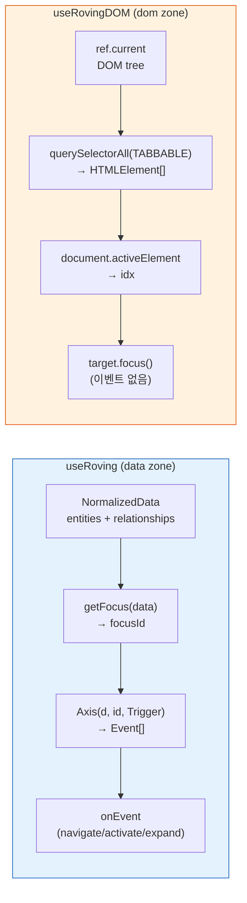
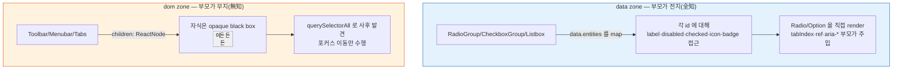
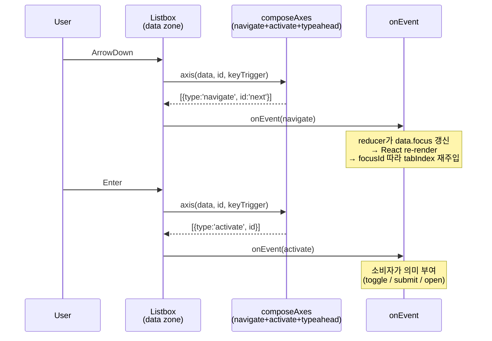
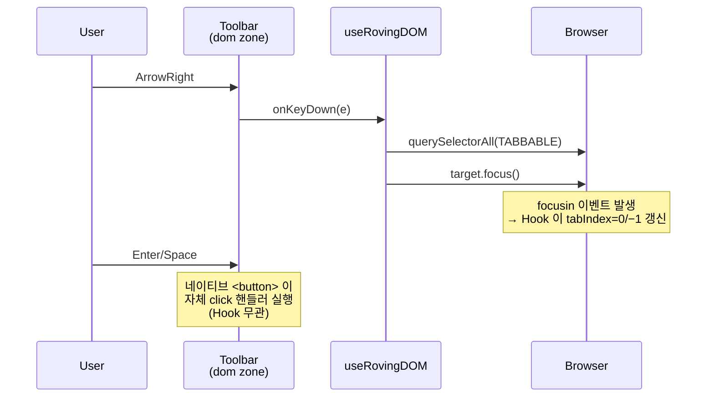
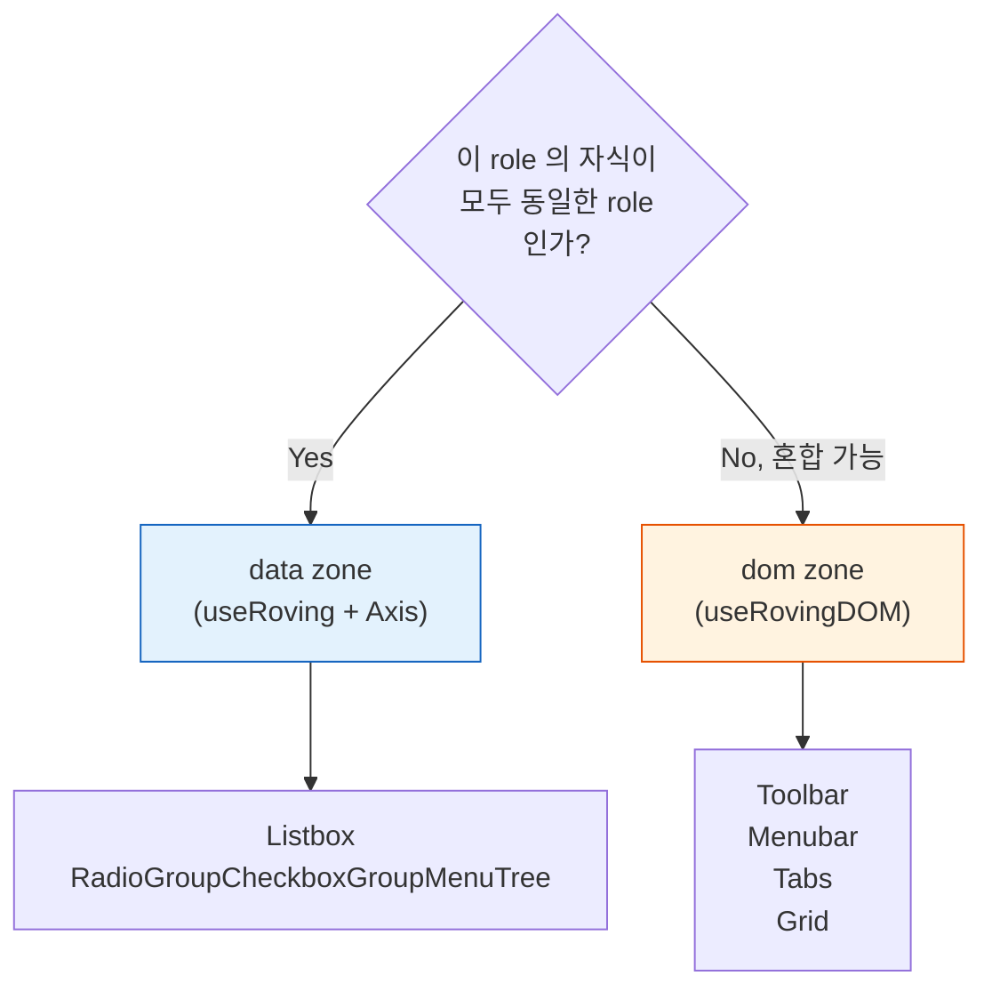

# roving: data zone vs dom zone — 왜 두 개여야 했나

> 작성일: 2026-04-25
> 맥락: ds 키보드 감사 후속에서 "단일 구조 수렴" 방향 점검 중 드러난 구조적 분기

> - `useRoving`(16줄, data 기반)과 `useRovingDOM`(59줄, DOM 기반)은 이름은 같지만 푸는 문제가 다르다
> - 전자는 `NormalizedData`를 순회하고 `onEvent`로 의미 있는 이벤트를 방출한다 — 후자는 DOM 포커스 가능 원소를 순회하고 `target.focus()`만 수행한다
> - "roving 두 개를 하나로 합칠 수 있지 않나?" 라는 질문의 답은 "없다" — **출처가 없는 것은 만들 수 없다**
> - 경계는 편의가 아니라 자식의 동질성(homogeneous vs heterogeneous)에 의해 결정된다

---

## 출처가 다르면 만들 수 있는 것도 다르다

roving의 목표는 동일하다 — 그룹 내 Tab stop 1개, Arrow로 포커스 이동, 선택 항목 기억. 그러나 **무엇을 순회하느냐**의 출처(source of truth)가 완전히 다르다.



| | data zone | dom zone |
|---|---|---|
| 출처 | `NormalizedData.entities` | `root.querySelectorAll(TABBABLE)` |
| 포커스 추적 | `getFocus(data)` 상태 | `document.activeElement` 런타임 |
| 항목 식별 | 안정 id (`data-id`) | 배열 인덱스 (`items.indexOf`) |
| 출력 | `Event[]` (의미) | `target.focus()` (기제) |
| 지원 축 | navigate·activate·expand·typeahead | navigate 뿐 |

→ dom zone에는 "어떤 항목이 disabled 인가", "어떤 id가 checked 인가", "typeahead용 label은 무엇인가" 를 물을 데이터가 **애초에 없다**. 이건 구현 누락이 아니라 출처의 귀결이다.

---

## 부모가 아는 것이 다르다 — knowledge asymmetry

같은 roving 구현도 소비자 쪽 모양이 완전히 뒤집힌다. 부모가 자식에 대해 "모든 것을 알고 있는가" vs "아무것도 모르는가"가 갈림길.



**data zone 실제 코드** — `Listbox.tsx:35-57` 은 `data.entities[id].data` 에서 icon·badge·selected 를 꺼내 `<Option>`에 직접 주입한다. 부모가 자식의 속성을 **렌더 시점에** 모두 안다.

```tsx
const d = data.entities[id]?.data ?? {}
<Option
  ref={bindFocus(id)}
  selected={Boolean(d.selected)}
  disabled={isDisabled(data, id)}
  tabIndex={focusId === id ? 0 : -1}   // ← 부모가 roving tabindex 주입
  data-icon={d.icon as string | undefined}
  data-badge={d.badge as string | number | undefined}
>
```

**dom zone 실제 코드** — `Menubar.tsx:10-16` 은 `children: ReactNode`를 그대로 받는다. 부모는 자식이 `<MenuItem>`인지 `<Divider>`인지 `<button>`인지 **모른다**.

```tsx
export function Menubar({ orientation = 'horizontal', children, ...rest }: MenubarProps) {
  const { onKeyDown, ref } = useRovingDOM<HTMLUListElement>(null, { orientation })
  return (
    <ul ref={ref} role="menubar" onKeyDown={onKeyDown} {...rest}>
      {children}     {/* ← 자식 구조·타입 전혀 모름 */}
    </ul>
  )
}
```

→ 그래서 `useRovingDOM`은 tabindex를 `useEffect + focusin`으로 **사후 관리**할 수밖에 없다 — 렌더 시점엔 자식이 누구인지 모르기 때문. 반대로 `useRoving`은 React prop으로 `tabIndex={focusId === id ? 0 : -1}`을 **사전 주입**한다.

---

## 의미(Event) vs 기제(focus) — 출력의 층위가 다르다

data zone은 "navigate A → B" 같은 **의미 있는 이벤트**를 뽑아낸다. dom zone은 "B 엘리먼트에 focus()" 라는 **브라우저 기제**를 호출한다. 이 차이는 composeAxes 의 존재 의의와 직결된다.





→ data zone은 **"무엇이 일어났는가"** 를 기술(activate/expand/navigate)하고 의미 해석은 소비자가 담당. dom zone은 **"포커스가 움직였다"** 까지만 책임지고 활성화는 네이티브 `<button>`에 전적으로 위임. Listbox가 typeahead를 지원하지만 Toolbar가 못 하는 이유 — typeahead는 `data[id].label` 이 필요한데 dom zone엔 label 출처가 없다.

---

## 합칠 수 없다 — DOM에는 activate/expand/typeahead 모델이 없다

"useRoving 하나로 통합하자" 는 유혹은 강하지만 **출처 문제 때문에 불가능**하다. dom zone에 data 모델을 억지로 끼우면 3가지 퇴행이 동시에 발생한다.

| 통합 시도 | 퇴행 |
|---|---|
| 모든 자식에 `data-id`·`data-disabled` 강제 | classless 원칙 위반, 자유 JSX 철학 붕괴 |
| 자식에서 label/checked를 DOM attr로 읽기 | typeahead가 `innerText` 파싱으로 전락, i18n·ellipsis 취약 |
| 부모가 `children`을 분석해 메타 추출 | React.Children 재귀 + `cloneElement` — 수년간 비판받은 안티패턴 |

반대 방향(data zone을 dom으로 끌어내리기)도 마찬가지 — `NormalizedData`의 힘(semantic Event, composeAxes 조합)을 전부 버린다.

→ 두 zone은 **출처가 다른 두 세계** 이지 같은 문제의 두 구현이 아니다. 산업 de facto(Radix의 Collection vs Presence, Ariakit의 Collection vs Composite)도 이 분리를 동일하게 유지한다.

---

## 경계 판단 기준 — "자식이 동질적인가?"

어느 zone을 쓸지는 실전 판단이 쉽다. 단 하나의 질문이면 된다.



- **data zone 트리거** — `CollectionProps<Extra>` 를 받는다, 자식 role이 고정이다, selected/checked/disabled 상태가 풍부하다, typeahead·expand 필요하다
- **dom zone 트리거** — `children: ReactNode` 를 받는다, 자식에 divider·label·섹션 등 혼합 허용, 활성화는 네이티브 `<button>`이 충분하다

ds 현재 분포: data zone 6개(Listbox·RadioGroup·CheckboxGroup·Menu·Tree·TreeGrid), dom zone 5개(Toolbar·Menubar·Tabs·Grid·DataGrid). 총 11개 — 두 zone 각각 과반 차지 못함 = **어느 쪽도 억지 수렴 아님**.

→ "단일 구조 수렴" 담론에서 이 선은 타협 대상이 아니다. 오히려 **두 zone의 경계를 훅(guardOsPatterns)으로 정적 검사**해 드리프트를 차단하는 게 다음 수순이다.

---

## 종합

roving 통합 불가론은 "둘 다 키보드 포커스 이동하는데 왜 다른 구현?" 이라는 표면 질문에 대한 구조적 답이다.

1. **출처의 비대칭** — 데이터가 있으면 의미를, 없으면 기제를 다룰 수밖에 없다
2. **지식의 비대칭** — 부모 전지(全知) 모델과 무지(無知) 모델은 합쳐지지 않는다
3. **출력의 층위 비대칭** — Event 방출(composeAxes 가치)과 focus 이동(platform 위임)은 다른 추상 수준이다

ds의 현재 방향은 정확하다. 두 zone을 **공식 시민**으로 인정하고, 그 사이 경계만 엄격히 지키면 된다. 단일화 시도는 수확체감을 넘어 손실 구간이다.
