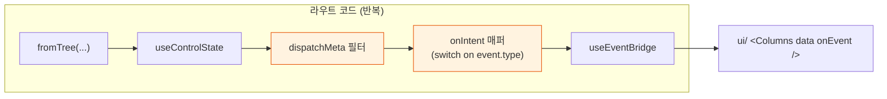
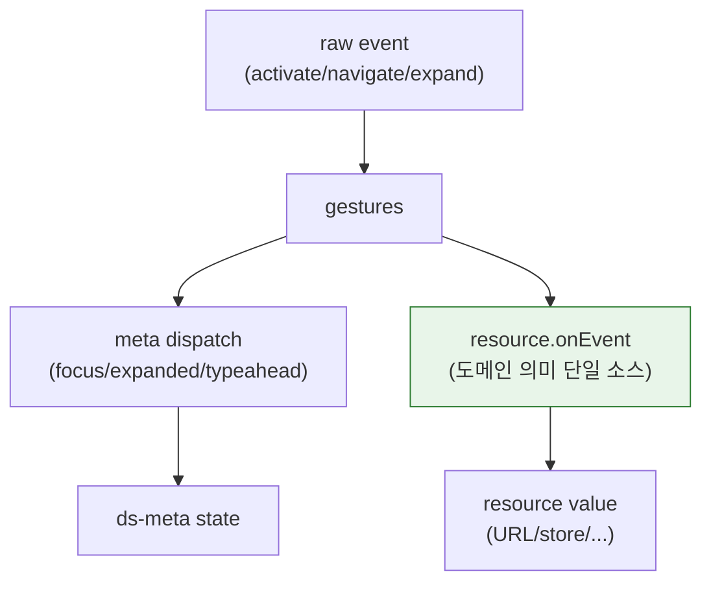
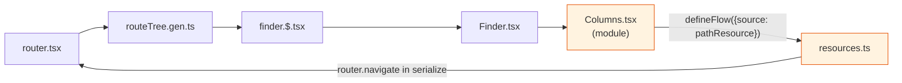
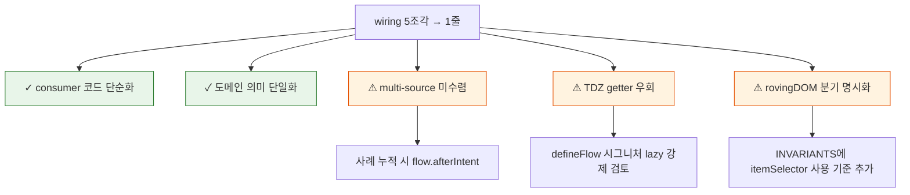

# defineFlow + useFlow 도입 회고 — 무엇이 좋아졌고 어디가 갭인가

> 맥락: Finder Columns의 분기 switch + useControlState hydrate-once 버그를 풀려 useEventBridge 도입 → defineFlow/useFlow + Resource.onEvent로 일원화. 시범 마이그레이션 후 실측 결과를 기록한다.

> - 라우트마다 반복하던 wiring 5조각이 1줄로 수렴했다 (Columns: 60→45줄, 본체 5줄)
> - 그러나 "1 flow = 1 source" 가정이 깨지는 자리(Sidebar의 path+pinnedRoot)는 추상이 닫히지 않고 wrap이 필요했다
> - 모듈 레벨 flow 정의가 routeTree 순환 import에서 TDZ를 유발 — `get source()` getter 우회 강제
> - **결론: wiring 평균 비용은 줄었지만, 코너 케이스가 추상의 가장자리를 드러냈다 — 1차 검증으로는 합격, 정착엔 코너 정리 필요.**

---

## Why — wiring 5조각이 라우트마다 곱해지는 부채가 컸다

`useFlow` 이전, 모든 컬렉션 ui 소비처는 같은 5조각을 손수 조립해야 했다.



Finder Columns만 60줄이었고, 같은 패턴이 Sidebar/atlas/genres에 N벌 복제될 예정이었다. 게다가 useControlState의 hydrate-once 버그(URL→base seed 갱신이 meta로 전파 안 됨)가 5조각 중 ②~③에 책임 분산된 형태로 잠복.

→ wiring 5조각의 산술 평균 비용 × N라우트 + 잠복 버그 = 부채 누적.

---

## Wins 1 — consumer 코드가 한 줄로 수렴했다

`useFlow(flow)` 이후 Columns 본체는 5줄로 줄었다.

```tsx
export function Columns() {
  const [data, onEvent] = useFlow(finderColumnsFlow)
  return <ColumnsRole data={data} onEvent={onEvent} aria-label="컬럼" />
}
```

Sidebar도 동형 — `useSidebarNav()`가 두 flow를 묶고 사이드바는 두 listbox에 꽂기만 하면 됨. 라우트 wiring은 **선언형 flow 정의**(다른 모듈)와 **소비**(라우트)로 갈렸다.

| 사용처 | 라인 수 (before → after) | 분기 코드 |
|--------|------|----------|
| `Columns.tsx` | 60 → 45 | switch on event.type 제거 |
| `useSidebarNav.ts` | 47 → 56 | 다중 flow 선언만 늘어남, switch 제거 |
| `Finder.tsx` | onPick/pickSidebar 보일러플레이트 제거 | — |

→ **라우트 코드 전체가 줄었다는 것보다, "분기 switch가 사라졌다"가 핵심**. LLM도 사람도 분기 switch 부재를 1 role = 1 flow로 다시 학습.

---

## Wins 2 — resource가 intent 라우터를 흡수하면서 도메인 일관성이 올라갔다

`Resource.onEvent: (e, ctx) => 다음값`이 도메인 의미를 한 곳에 모았다.

```ts
export const pathResource = defineResource<string>({
  ...,
  onEvent: (e, { data }) => {
    if (e.type === 'activate' || e.type === 'navigate') return e.id
    if (e.type === 'expand') {
      if (e.open) return e.id
      const parent = parentOf(data, e.id)
      return !parent || parent === ROOT ? '/' : parent
    }
  },
})
```

이전엔 같은 매핑(activate→navigate, expand→parent navigate)이 Columns 소비처와 mobile DirList와 atlas의 nav에 중복으로 적혀 있었다. 이제 path의 의미 변경은 resource 1곳만 고치면 된다.



→ ds-meta(focus/expand)와 도메인 state가 **같은 추상 위에 직교 분리**. 옛 패턴은 둘이 라우트 코드 안에 뒤섞였다.

---

## Gap 1 — Multi-source intent는 flow 밖 wrap을 강제한다

Sidebar 즐겨찾기 클릭은 path + pinnedRoot 두 resource를 동시에 갱신해야 한다. 그런데 `flow.source`는 단일.

```ts
export function useSidebarNav() {
  const [favData, favEventRaw] = useFlow(favFlow)
  // 추상 밖에서 wrap — flow가 닫지 못한 코너
  const favEvent = (e: Event) => {
    if (e.type === 'activate' && !isSmartPath(e.id)) {
      writeResource(pinnedRootResource, e.id)
    }
    favEventRaw(e)
  }
  return { fav: { data: favData, onEvent: favEvent } }
}
```

원칙적으로 두 가지 길이 있다:
- **A) flow.afterIntent: (e) => void** 부수 효과 슬롯 — flow API가 한 단계 더 비대화
- **B) "compound resource"** 정의 — pathResource + pinnedRootResource를 묶는 새 resource. 단, ds 원칙(useResource 단일 인터페이스)과 정합하지만 추상화 1단 더 추가.

지금은 wrap으로 외부 처리 중. **추상이 100%로 닫혀 있지 않다**는 신호.

→ flow.afterIntent가 들어올 자리. multi-source 사례가 2건 이상 누적되면 도입 후보.

---

## Gap 2 — 모듈 레벨 flow 정의가 순환 import에서 TDZ를 유발한다

`defineFlow({ source: pathResource, ... })`가 모듈 평가 시점에 pathResource를 즉시 캡처. routeTree → 라우트 → 컴포넌트 → flow → resource → router → routeTree 순환에서 module init 순서가 꼬여 `Cannot access 'pathResource' before initialization` 발생.

**우회**: `get source() { return pathResource }` getter — 평가 지연.



→ getter 우회는 동작하지만 **선언형 flow 정의가 작동하려면 ad-hoc workaround가 1줄 필수**. INVARIANTS급 룰로 굳히거나, defineFlow 자체가 lazy를 강제하도록 시그니처 바꿀 후보.

옵션:
- (a) `defineFlow({ source: () => pathResource })` — 항상 thunk, 모든 사용자가 인지
- (b) 현재 + 문서화 ("순환이 의심되면 getter")
- (c) routeTree에서 lazy route component import — 큰 수술

당장은 (b), 누적되면 (a).

---

## Gap 3 — 부수 발견된 useRovingDOM/TreeRow 결함

이번 마이그레이션과 직접 인과는 없지만, 사용자 검증 중 ListView 키보드가 안 먹어 발견됐다.

| 결함 | 위치 | 수정 |
|------|------|------|
| TABBABLE이 `tabindex=-1` 제외 → 모든 row가 -1로 시작하는 그룹은 발견 불가 | `useRovingDOM.ts` | `itemSelector` 옵션 추가 |
| TreeGrid가 모든 [tabindex] 매치 → row 외 GridCell까지 navigate 대상이 됨 | `TreeGrid.tsx` | `itemSelector: '[role="row"]'` 명시 |

→ flow 도입과는 별건. 다만 "Unified roving — self-attach" 원칙이 자연 tabbable(button)과 명시 row 그룹 두 패턴을 동시에 다뤄야 한다는 사실을 드러냄. itemSelector는 그 분기를 명시화한 것.

---

## 종합 — 1차 검증 합격, 정착에 코너 3개



| | 의미 | 다음 액션 |
|--|------|----------|
| Win 1 | 라우트 코드/분기 0 | atlas/genres 마이그레이션 진행 |
| Win 2 | 도메인 의미 단일 소스 | 다른 resource(viewResource 등)에도 onEvent 후보 검토 |
| Gap 1 | multi-source는 wrap 임시 | 사례 2건 누적되면 flow.afterIntent 도입 |
| Gap 2 | TDZ getter 1줄 우회 | 마이그레이션 누적 후 defineFlow lazy 강제 검토 |
| Gap 3 | itemSelector 패턴 분기 | TreeRow/TreeGrid 외 사용처도 점검 (DataGrid 등) |

→ **wiring 평균은 이겼고, 코너는 알려졌다.** 다음 패스는 atlas migration + Gap 1 사례 수집.
