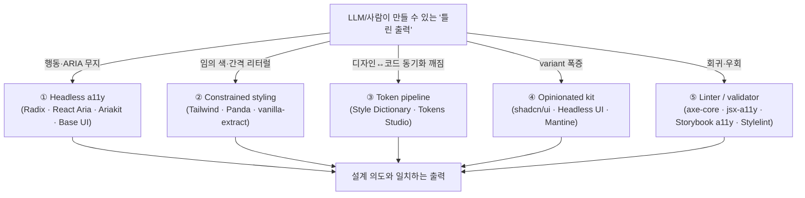
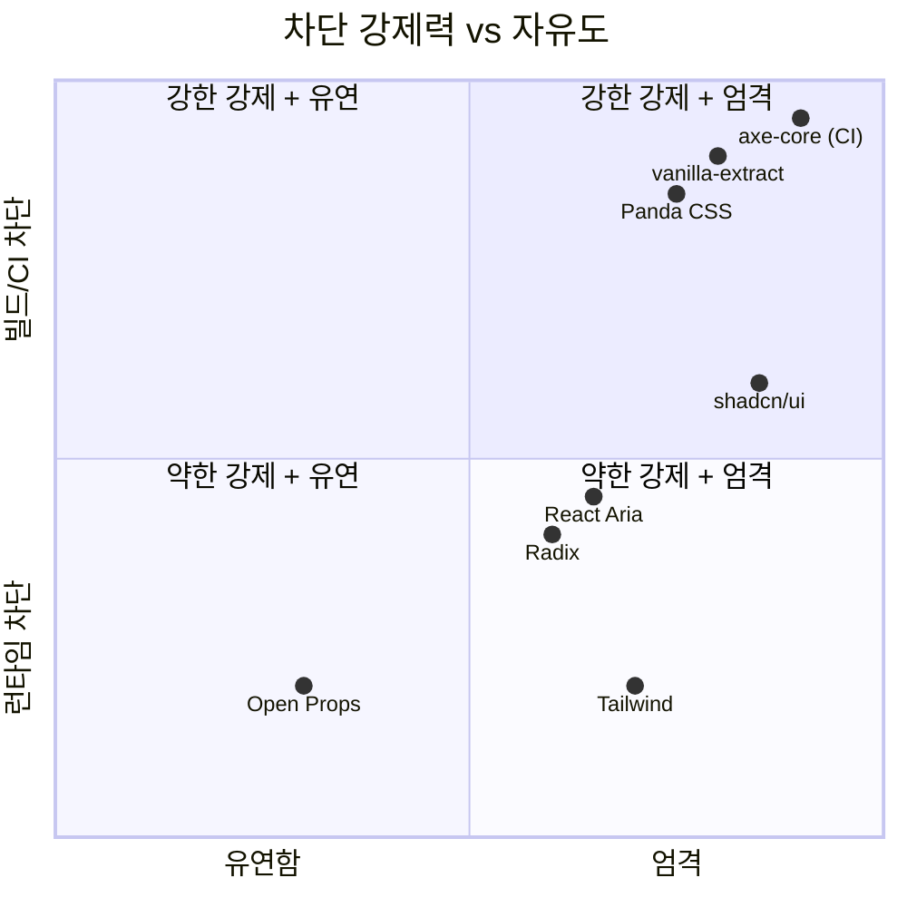

# 틀리지 않는 디자인을 도와주는 라이브러리 지도

## TL;DR

"틀리지 않는 디자인"을 만드는 라이브러리는 **잘못된 출력의 비용을 비싸게 만드는 메커니즘**으로 분류된다 — (1) 행동/ARIA를 캡슐화한 headless, (2) 토큰만 ergonomic하게 만든 styling, (3) 디자이너↔코드 토큰 파이프라인, (4) 선택지를 1개로 잘라낸 opinionated kit, (5) CI에서 위반을 차단하는 linter. ds 프로젝트는 (1)(2)(4) 원리를 이미 흡수했고, **갭은 (5) 강제 도구**다.

## Why — 왜 지금 중요한가

ds 프로젝트는 이미 "1 role = 1 component / no escape hatches / classless ARIA / data-driven / token-only color"를 선언했다 (`MEMORY.md`). 하지만 내부 감사 결과: **함수는 있고 강제는 없다**. raw `role="..."` 0개, hex 리터럴 0개, variant 0개를 사람·LLM이 약속만으로 지키고 있다. 외부에는 이 종류의 위반을 **lint·snapshot·CI 단계에서 차단**하는 성숙한 도구들이 있고, 이들이 "틀리지 않는 디자인"의 마지막 1마일을 책임진다.

## How — 5계층 차단 메커니즘

## What — 카테고리별 라이브러리

### ① Headless a11y (행동·ARIA 정답)

| 라이브러리 | 차단하는 "틀림" | 1줄 차별점 | URL |
|---|---|---|---|
| **Radix UI Primitives** | 잘못된 role 중첩, focus trap 누락, 키보드 맵 오류 | de facto React 표준, composable primitive | https://www.radix-ui.com/primitives |
| **React Aria (Adobe)** | i18n/RTL, 터치, 스크린리더 quirk | hook-level, 가장 깊은 a11y 연구 | https://react-spectrum.adobe.com/react-aria/ |
| **Ariakit** | composite/roving tabindex 엣지 케이스 | 명시적 Composite 모델 | https://ariakit.org/ |
| **Base UI** | MUI a11y 테스트 suite + Radix-style API | MUI의 headless 후계 | https://base-ui.com/ |
| **Headless UI** | 가장 작은 표면 = 가장 적은 선택지 | Tailwind 짝꿍 | https://headlessui.com/ |

### ② Constrained styling (토큰·스케일 강제)

| 라이브러리 | 메커니즘 | URL |
|---|---|---|
| **Tailwind CSS** | 임의값은 `[...]` 명시 → diff에서 보임 | https://tailwindcss.com/ |
| **Panda CSS** | 알 수 없는 토큰은 TS 에러 (build-time) | https://panda-css.com/ |
| **vanilla-extract** | `createThemeContract`로 테마 패리티 컴파일 강제 | https://vanilla-extract.style/ |
| **CVA** | type-safe variant API, ad-hoc className 제거 | https://cva.style/ |

### ③ Design token pipelines

- **Style Dictionary (Amazon)** — 단일 토큰 → CSS/iOS/Android 다출력. v4 W3C 포맷. https://styledictionary.com/
- **Tokens Studio** — Figma 측 권위, JSON 동기화. https://tokens.studio/

### ④ Opinionated kits (선택지 최소화)

- **shadcn/ui** — Radix + Tailwind를 **레포에 복붙**. 의존성이 아니라 단일 정답 코드. 75k+ stars. https://ui.shadcn.com/
- **Mantine** — strict prop API + 강한 기본값. https://mantine.dev/
- **Chakra UI** — 토큰-prop ergonomic. https://chakra-ui.com/

### ⑤ Linters / validators (CI 차단)

- **axe-core** — WCAG 룰 엔진. 거의 모든 a11y 도구의 코어. https://github.com/dequelabs/axe-core
- **eslint-plugin-jsx-a11y** — JSX 정적 룰. https://github.com/jsx-eslint/eslint-plugin-jsx-a11y
- **Storybook a11y addon** — story마다 axe 실행, CI에서 회귀 차단. https://storybook.js.org/addons/@storybook/addon-a11y
- **Stylelint + custom rules** — raw hex/px 리터럴 금지 → 토큰만 가능

### ⑥ Insightful alternatives

- **Open Props** — JS 0, pure CSS custom property로 토큰 레이어만 제공. 프레임워크 독립. https://open-props.style/
- **UnoCSS** — 룰 엔진 자체가 플러그인. "임의값 금지" 룰을 직접 작성 가능. https://unocss.dev/
- **Kobalte (Solid) / Bits UI (Svelte) / Park UI** — Radix급 a11y를 다른 프레임워크에서. https://kobalte.dev/

## What-if — ds에 적용하면

내부 감사 결과 ds는 (1)(2)(4)를 **자체 구현**으로 흡수했다 (Radix/Ariakit/RAC 최소 2곳 수렴 네이밍, 토큰 3-tier, parts 단일 구현). 따라서 **외부 라이브러리를 도입하는 게 아니라, 그들이 쓰는 강제 도구를 차용**하는 것이 정합적이다:

| 갭 | 차용할 도구 | 강제 지점 |
|---|---|---|
| raw hex/px 리터럴 차단 | **Stylelint + declaration-property-value-allowed-list** | pre-commit |
| raw `role="..."` 차단 | **eslint-plugin-jsx-a11y + custom rule** (또는 기존 `guardOsPatterns.mjs` 확장) | pre-commit |
| 상태 완전성 (rest/hover/focus/active/disabled) | **Storybook a11y addon + interaction tests** 또는 직접 snapshot | CI |
| 토큰-디자인 동기화 | **Style Dictionary (W3C 포맷)** | build |

shadcn/ui·Radix 자체를 import하는 건 ds 철학 위반(Classless·자체 단일 구현 원칙)이지만, **그들이 코드 안에 인코딩한 ARIA 결정 트리는 reference 자료**로 계속 가치 있다.

## 흥미로운 이야기

- Radix는 **WAI-ARIA APG의 행동을 코드로 동결**한 첫 라이브러리에 가깝다. 그 전에는 "Authoring Practices Guide를 읽고 직접 구현"이 표준이었다 — 즉 모두가 다르게 틀렸다.
- shadcn/ui의 "not a dependency" 철학은 npm 의존성 폭발에 대한 반작용이자, **소유권을 사용자에게 강제로 돌려주는 정치적 디자인**이다. ds의 "raw role 0개, 모든 부품 자체 보유" 원칙과 동일 계열.
- Tailwind의 `[arbitrary-value]` 문법은 단순 escape hatch가 아니라 **diff에서 위반을 보이게 만드는 사회공학**이다 — 코드리뷰어가 `bg-[#abc]`를 발견하면 자동으로 멈춘다.
- React Aria가 Radix보다 덜 유명하지만 더 깊은 이유: Adobe가 **스크린리더·터치·RTL을 실제 검증한 a11y 연구를 코드로 출고**하기 때문. "정답을 외주"하고 싶다면 Radix보다 React Aria.

## Insight

**한 줄 결론**: ds는 (1)(2)(4) 계층의 *원리*를 자체 흡수했으나 (5) *강제 도구* 계층이 비어 있다. 다음 한 걸음은 라이브러리 도입이 아니라 **Stylelint·custom ESLint·Storybook a11y로 "틀린 출력의 비용"을 빌드·CI 단계에서 비싸게 만드는 것**.

**프로젝트 규약과의 정합성**:
- ✅ 일치: Radix·Ariakit·RAC 네이밍 수렴은 이미 `project_ds_naming_conventions`에 명시
- ✅ 일치: shadcn의 "단일 정답 보유" ≈ ds의 `feedback_no_escape_hatches`
- ⚠️ 부분 충돌: Tailwind/Panda는 className 기반 → `feedback_classless_html_aria` (스타일 전용 class 금지)와 충돌. 원리(토큰만 ergonomic)만 차용하고 구현은 ds의 ARIA 셀렉터로 수렴해야 함
- ⚠️ 부분 충돌: shadcn copy-paste 모델은 매력적이지만 ds는 더 엄격(완전 자체 구현). 외부 raw role 의존 0개를 유지

## 출처

- Radix UI Primitives — https://www.radix-ui.com/primitives
- React Aria (Adobe) — https://react-spectrum.adobe.com/react-aria/
- Ariakit — https://ariakit.org/
- Base UI — https://base-ui.com/
- Headless UI — https://headlessui.com/
- Tailwind CSS — https://tailwindcss.com/
- Panda CSS — https://panda-css.com/
- vanilla-extract — https://vanilla-extract.style/
- CVA — https://cva.style/
- Style Dictionary — https://styledictionary.com/
- Tokens Studio — https://tokens.studio/
- shadcn/ui — https://ui.shadcn.com/
- Mantine — https://mantine.dev/
- Chakra UI — https://chakra-ui.com/
- axe-core — https://github.com/dequelabs/axe-core
- eslint-plugin-jsx-a11y — https://github.com/jsx-eslint/eslint-plugin-jsx-a11y
- Storybook a11y addon — https://storybook.js.org/addons/@storybook/addon-a11y
- Open Props — https://open-props.style/
- UnoCSS — https://unocss.dev/
- Kobalte — https://kobalte.dev/
- Bits UI — https://bits-ui.com/
- Park UI — https://park-ui.com/
