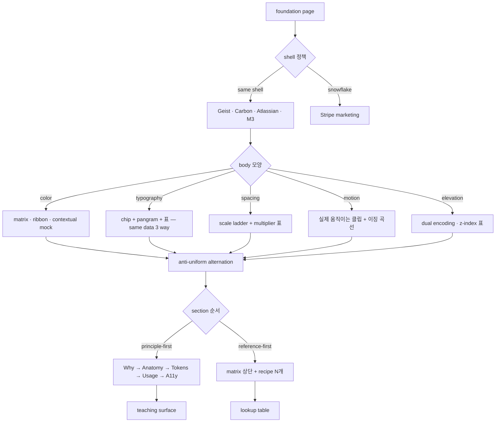
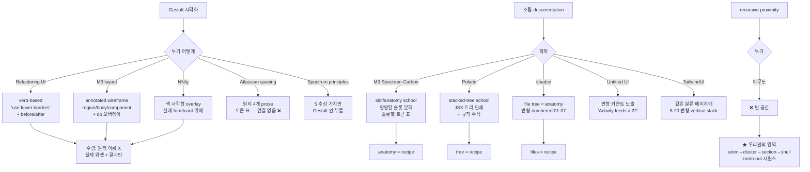

# Foundation 페이지 — 벤더 수렴 패턴

## TL;DR

벤더 9사 (Tailwind, Radix, Material 3, Carbon, Vercel Geist, Linear, Stripe, Atlassian, Polaris, Spectrum) 의 foundation 페이지가 "다채로워" 보이는 이유는 데이터 두께가 아니라 **세 가지 구조적 결단** 때문:

1. **Same shell, mutating body** — 페이지 chrome 은 균일하게 두되 body 는 카테고리마다 다른 시각 형태로 (Vercel Geist 정수). Color = matrix·ribbon, Typography = chip + pangram + 표, Spacing = 라더 막대, Motion = 실제 움직이는 클립, Elevation = shadow + tonal dual encoding.
2. **Principle-first 템플릿** — `Why → Anatomy → Tokens → Usage → Accessibility` 5단 (Carbon·M3). 토큰 표는 항상 마지막. 앞에 prose·anatomy diagram·do/don't 가 먼저 와서 위계를 만든다.
3. **Anti-uniform alternation** — 같은 페이지 안에서 (a) dense matrix (b) rendered specimen at actual size (c) realistic component preview (d) code snippet 4가지 shape 를 반복. 두 섹션 같은 shape 금지 (Tailwind·Radix 공통).

## Why — 왜 지금 이 질문이 중요한가

`/foundations` 가 현재 `definePage` auto-loop 으로 4-필드 카드(name·doc·signature·demo) 를 grid 로 뿌리는 dev catalog. 같은 chrome (definePage Renderer) 안에서 페이지마다 모양을 다르게 만드는 어휘가 없어서 "균일 = 평평" 함정에 갇힘. 벤더 수렴 패턴을 어휘 단위로 추출해야 우리 제약 (classless·role-only·definePage) 안에서 다채로움을 만들 길이 보임.

## How — 벤더 수렴 메커니즘



핵심 통찰: **정체성 결단**이 먼저. M3·Carbon 은 *teaching surface*, Tailwind 는 *lookup table*. 둘 사이 어중간한 자리에 서면 자동으로 "균일 grid 카드" 가 됨 — 우리 현재 상태.

## What — 카테고리별 수렴 패턴

### Color
| 벤더 | hero | 표현 |
|---|---|---|
| Tailwind | 25hue × 11step matrix-as-hero (275 swatch) | click-to-copy OKLCH, 행이 그라데이션 ribbon 으로 읽힘 |
| Radix Colors | 30hue × 12step wall, **컬럼 헤더가 semantic legend** (1-2 bg, 3-5 interactive, 6-8 border, 9-10 solid, 11-12 text) | 라이브 palette generator |
| Radix Themes | 단일 12-step ribbon + 라이브 컴포넌트 (Callout, Button) + JSX | scale 안에 prose |
| M3 | 5 tonal palette × 11 tone, 폰 mockup 라이트/다크 페어 | Theme Builder 외부 링크 |
| Geist | swatch grid 없음. **각 scale 이 실제 product mock 안에 박혀** (gray = log viewer, blue = button) | naming-as-doc (1-3 bg, 4-6 border, 7-8 solid, 9-10 text) |
| Spectrum | global ramp → alias 표 → component cross-ref **3-tier stacked** | dark mode toggle, 대비 슬라이더 (low/std/high) |

수렴: **swatch grid + semantic 컬럼 라벨링** 또는 **단일 ribbon + 라이브 컴포넌트**. 둘 중 하나의 정체성.

### Typography
| 벤더 | 표현 |
|---|---|
| Tailwind | 13 step (xs→9xl) **실제 렌더 사이즈** specimen — 작은 글씨에서 자라남 |
| Radix Themes | 같은 scale 을 **3 way 로** — Aa1…Aa9 chip strip + pangram (size 6) + 숫자 표 (Step·Size·LetterSpacing·LineHeight) |
| M3 | 15 role (Display/Headline/Title/Body/Label × L/M/S) Roboto/Flex 실 사이즈, 스펙 표 옆에 |
| Carbon | Productive vs Expressive 두 스케일, 각 행은 라이브 `<h*>` 엘리먼트 + px/rem/line-height 컬럼 |

수렴: **same data 3 way** — visual chip + pangram + 숫자 표. 한 페이지에서 같은 토큰이 다른 모양으로 3번 등장.

### Spacing
| 벤더 | 표현 |
|---|---|
| Tailwind | side-by-side labeled boxes per recipe (`p-4` vs `p-8`) — grid 아닌 쌍 비교 |
| Atlassian | **scale ladder 0–80px** Small/Medium/Large 세그먼트 + 표 (Token · Multiplier 0×–10× · REM · PX · **시각 swatch 컬럼**) |
| Carbon | 가로 막대 폭 = 토큰 값 (spacing-01 = 2px 막대 …, spacing-13 = 160px 막대), 막대 안에 px 라벨 |
| Geist | grid 자체를 **브랜드 정체성**으로 — utility 가 아니라 identity |

수렴: **막대 폭 = 토큰 값** 의 직접 시각화. 추상 숫자가 아니라 눈으로 보는 길이.

### Motion
| 벤더 | 표현 |
|---|---|
| M3 | 모든 easing/duration entry 옆에 **루핑 클립**. easing 곡선을 SVG 그래프 + 점이 곡선 따라 움직임 |
| Carbon | 4 expression type (productive/expressive × entrance/exit) 각각 mp4/gif 클립 + cubic-bezier 코드 |
| Spectrum | 재생/일시정지 버튼 있는 클립 + anatomy (timing phases + curve) |
| Geist/Linear | foundation 페이지에 motion 없음 — "조용한 docs" 입장 |

수렴: motion 페이지는 **페이지 자체가 움직여야** 한다. 정적 표만 있으면 motion 을 보여주는 게 아니라 motion 의 메타데이터를 보여주는 것.

### Elevation
| 벤더 | 표현 |
|---|---|
| M3 | 5단 카드 floating + **dual encoding** — 같은 surface 좌측 shadow, 우측 tonal overlay (surfaceContainerLowest → Highest) 페어. 익소노메트릭 stack 다이어그램 |
| Atlassian | 4-tier ladder (Sunken/Default/Raised/Overlay) **라이트 + 다크 side-by-side** + 별도 **z-index 숫자 표** (Modal 510, Flag 600, Tooltip 800) — 토큰 → 컴포넌트 명시 |
| Carbon | 토큰 표 + 라이브 카드 |

수렴: elevation 은 **z 가 중첩된 stack 다이어그램** + **shadow vs tonal dual encoding** + **z-index 숫자 표 (cross-ref)**. 세 가지 view 가 한 페이지에 공존.

## What-if — 우리 /foundations 에 적용한다면

현재 제약: `definePage` Renderer + classless + role-only. 그래도 다음은 즉시 가능:

### 1) Same shell, mutating body — entity 어휘 확장
현재 entity 가 `Section/Header/Grid/Card` 정도로 빈약. 추가 필요:

```typescript
// FlatLayout entity 확장 (디자인 페이지용)
type ShowcaseEntity =
  | { type: 'TokenMatrix';   data: Token[][];      cell: 'swatch'|'value'|'specimen' }
  | { type: 'TokenLadder';   tokens: Token[];      barProperty: 'width'|'height' }
  | { type: 'TierDiagram';   layers: Layer[];      arrows: TokenRef[] }
  | { type: 'LiveSpecimen';  component: string;    props: Record<string,unknown> }
  | { type: 'MotionClip';    keyframes: K[];       loop: boolean }
  | { type: 'CodeSnippet';   lang: 'tsx'|'css';    copyable: true }
```

이 6개 entity 만 있으면 Tailwind/Radix/M3/Atlassian 패턴 90% 커버.

### 2) 페이지 단위 큐레이션 — auto-loop 폐기
`@demo` 자동 수집은 **dev catalog (/dev/foundations)** 로 강등. 진짜 docs 는 손으로:

```
src/routes/foundations/
├── color.tsx        ← TokenMatrix(palette) + TierDiagram(palette→semantic) + LiveSpecimen
├── typography.tsx   ← chip strip + pangram + 표 (3-way)
├── spacing.tsx      ← TokenLadder + Atlassian-style multiplier 표
├── elevation.tsx    ← stack diagram + shadow/tonal dual + z-index 표
├── motion.tsx       ← MotionClip × ease·duration matrix
└── radius.tsx, hairline.tsx, focusRing.tsx ...
```

### 3) Principle-first 5단을 모든 페이지 골격으로
```
[Hero — 그 카테고리만의 시각]
[Why — 왜 이렇게 결정했나 (1단락)]
[Anatomy — 토큰 간 관계 다이어그램]
[Tokens — 표 / matrix / ladder]
[Usage — 라이브 컴포넌트 N개]
[Accessibility / Cross-ref — 어디서 쓰나]
```

5 섹션 중 **Anatomy** 가 가장 중요. 토큰들끼리의 관계를 그려야 "이 페이지를 본 이유" 가 생김.

### 4) 즉시 ROI 큰 1개
**Color 페이지부터.** Tailwind matrix-as-hero (palette 9단 × 5톤) + 컬럼 헤더 semantic legend (Radix 시그니처) + 하단 Spectrum 3-tier 다이어그램. 이거 하나만 잘 만들어도 페이지 정체성이 잡힘.

## 흥미로운 이야기

Tailwind v4 가 colors 페이지를 매트릭스-as-hero 로 만들면서 색 페이지의 표준이 바뀌었음. 이전 (v3) 까지는 파일럿 swatch 16개 정도였는데 v4 에서 OKLCH 전체 매트릭스를 펼쳐 보임. "lookup table" 정체성을 강화한 결단.

Geist 의 거꾸로 결단: swatch grid 폐지, 모든 색을 product mock 안에서만 보여줌. "what hex" 가 아니라 "where this lives" 를 가르침. Tailwind 와 정반대.

Linear Method 는 더 극단: docs 페이지가 **에세이**. 토큰 0개. "design system docs" 장르 자체를 거부. Tailwind 와 Geist 가 lookup vs teaching 의 양 끝이라면 Linear 는 아예 다른 좌표.

M3 가 motion 페이지에 **이징 곡선을 SVG 로 그리고 점이 따라 움직이는** 마이크로 인터랙션을 박은 게 2023 이후 모든 motion 페이지의 사실상 표준이 됨. Carbon 은 mp4 클립으로 정공법, M3 는 곡선 + 점으로 영리하게 — 같은 메시지 다른 매체.

Spectrum 3-tier 다이어그램 (global → alias → component) 은 Adobe 가 2018 께부터 쭉 밀던 패턴. 다른 벤더들이 차츰 차용 (Polaris, Atlassian) 하면서 enterprise DS 의 de facto 가 됨. **변경 진폭** 을 시각화하는 가장 명료한 어휘.

## Insight

**ds 규약 정합성: 부분 충돌 → 어휘 확장 후 일치 가능**

- ✅ classless / role-only / data-driven entity → 그대로 유지하면서 위 6개 entity 추가하면 모든 패턴 표현 가능
- ✅ minimize choices for LLM → "Same shell, mutating body" 자체가 이 원칙. shell 결정은 1번, body entity 는 카테고리당 1개로 고정
- ⚠️ definePage Renderer 의 `Section/Grid` 어휘만으로는 Atlassian ladder, M3 dual encoding, Spectrum 3-tier 표현 불가 → entity vocabulary 확장 필요
- ⚠️ auto-loop (audit.exports → fnCard) 는 dev tool 정체성. docs 정체성과 분리 필수
- ❌ 현재 `/foundations` 한 라우트가 두 정체성 (dev catalog + docs) 모두 떠안고 있어서 둘 다 어중간

권장 결단: `/dev/foundations` (현재 auto-loop 그대로) + `/foundations` (손 큐레이션, 카테고리당 1 페이지) **2-route 분리**. Polaris 가 `/design` (narrative) 와 `/tokens` (reference) 를 분리한 패턴.

## 출처

### Tailwind / Radix
- https://tailwindcss.com/docs/colors — 25hue × 11step matrix-as-hero, click-to-copy OKLCH
- https://tailwindcss.com/docs/font-size — 실제 렌더 사이즈 specimen
- https://tailwindcss.com/docs/box-shadow — floating cards in a row, tinted background
- https://www.radix-ui.com/colors — 30 × 12 wall + 컬럼 헤더 semantic legend
- https://www.radix-ui.com/themes/docs/theme/color — 단일 ribbon + 라이브 컴포넌트 + JSX
- https://www.radix-ui.com/themes/docs/theme/typography — same data 3 way (chip + pangram + 표)

### Material 3 / IBM Carbon
- https://m3.material.io/styles/color/system/overview — 5 tonal palette + 폰 mockup 페어
- https://m3.material.io/styles/elevation/overview — shadow + tonal overlay dual encoding
- https://m3.material.io/styles/motion/overview — 루핑 클립 + SVG 이징 곡선 + 점 애니메이션
- https://carbondesignsystem.com/elements/color/overview/ — 글로벌 테마 스위처가 페이지 자체를 리테마
- https://carbondesignsystem.com/elements/spacing/overview/ — 가로 막대 폭 = 토큰 값
- https://carbondesignsystem.com/elements/motion/overview/ — 4 expression type, mp4 클립

### Vercel Geist / Linear / Stripe
- https://vercel.com/geist/colors — swatch grid 폐지, product mock 안에 색 박음
- https://vercel.com/geist/typography — `<strong>` 중첩 = Subtle/Strong 토글, 모디파이어 철학
- https://vercel.com/geist/spacing — grid 자체를 브랜드 identity 로
- https://linear.app/method — 에세이 형식. 토큰 0개. 장르 거부

### Atlassian / Polaris / Spectrum
- https://atlassian.design/foundations/spacing — scale ladder 0–80 + multiplier 표 (0×–10×) + 시각 swatch 컬럼
- https://atlassian.design/foundations/elevation — 라이트/다크 side-by-side + z-index 숫자 표
- https://polaris.shopify.com/design/colors — principle-first, 토큰 표는 별도 /tokens 라우트로 분리
- https://spectrum.adobe.com/page/color-system/ — 3-tier (global → alias → component) stacked, 대비 슬라이더
- https://spectrum.adobe.com/page/typography/ — anatomy diagram (line-height/letter-spacing/weight call-outs)
- https://spectrum.adobe.com/page/motion/ — anatomy + timing phases + curve diagram

---

# Part 2 — Gestalt 가이드 + 조립(Feed/Chat/Card) 패턴

## TL;DR (Part 2)

색·타입 같은 토큰 페이지보다 **훨씬 어렵고 우리에게 가치 큰** 영역. 조사 결과 3가지 결정적 인사이트:

1. **누구도 recursive proximity 를 안 보여줌** — atom→cluster→section→shell zoom-out 시퀀스가 우리 ds (`hierarchy.ts` 5-tier) 만의 강점. 외부 어떤 벤더도 같은 어휘 없음. **개척지**.
2. **6-card Gestalt grid 절대 금지** — 효과적인 docs (Refactoring UI, M3 layout) 는 원리 이름조차 안 부름. 대신 *verb* ("use fewer borders") + *side-by-side same widget different token* 으로 보여줌.
3. **조립 (Feed/Chat/Card) 은 두 학파만 있음** — *slot/anatomy school* (M3, Spectrum, Carbon: 명명된 슬롯 분해) vs *stacked-tree school* (Polaris: JSX-shaped 트리 + 규칙 주석). 우리 `definePage entities tree` 는 후자에 천연 정합 — pattern doc 에 entity 트리를 그대로 인쇄하면서 옆에 ("Identity 는 proximity 그룹", "rows 는 similarity 공유") 주석.

## Why — 진짜 가치 영역

색은 누구나 swatch 그리면 끝. Tailwind/Radix/Geist 가 이미 정답 수렴. 따라가면 됨.

**조립 + Gestalt** 는 다름:
- 우리 ds 의 핵심 정체성 (`hierarchy = recursive Proximity`, classless, role-only, data-driven entity)
- 외부 벤더 누구도 동일 어휘로 풀지 않음 — 조사 거의 모든 결과에서 **gap** 으로 나타남
- production app (finder/inspector/feed/board) 이 이미 잘 작동함 → 데이터 두께 충분

→ 색은 따라가고, 조립·Gestalt 는 우리가 정의해야 할 영역.

## How — 시각화 메커니즘



## What — 카테고리별 구체 패턴

### Gestalt 시각화 — 효과적인 4가지

| 패턴 | 누가 | 어떻게 | 우리 적용 |
|---|---|---|---|
| **Verb, not noun** | Refactoring UI | "use fewer borders" / "avoid ambiguous spacing" / "hierarchy is everything" — 원리 이름 대신 동사 명령 | 페이지 H2 를 `hairlineWidth() 줄여라` 같은 동사로 |
| **Side-by-side same widget, different token** | Refactoring UI, NN/g | 같은 카드 두 번 — 잘못된 spacing (X 표시) vs 토큰 spacing (✓ 표시) | 우리 `partsCatalog.tsx` 에 1줄 추가하면 즉시 가능 |
| **Annotated overlay** | NN/g, M3 | 실제 form/card 위에 색 사각형 그룹핑 표시, dp 오버레이 | `<HierarchyOverlay>` debug 모드 — 인터랙티브, 어떤 벤더도 안 함 |
| **Recursive zoom-out** | ❌ 아무도 안 함 | — | ★ 우리 차별화: 같은 카드 → 클러스터 → 섹션 → shell 단계별 zoom |

### Gestalt 안티패턴 (절대 금지)

```
6-card Gestalt grid (proximity / similarity / closure / continuity / common region / figure-ground)
→ 이론서 톤. 효과적인 docs 모두 회피.
→ 원리 이름 부르지 말고 결과만 보여줘라.
```

### 조립 (Feed/Chat/Card) 시각화 — 4 핵심 어휘

| 어휘 | 누가 정수 | 형태 |
|---|---|---|
| **Slot anatomy 분해** | M3 Cards | `Container > Header > Media > Supporting text > Actions` 5-슬롯, 각 슬롯에 토큰 표 (color/elevation/shape/typescale) |
| **Stacked tree recipe** | Polaris date-picking | `Popover > Activator(TextField) + Content(Card > DatePicker)` JSX 트리 + 각 노드 옆 규칙 주석 |
| **Variant matrix** | TailwindUI Feeds, Untitled "× 22" | 같은 조립의 5-22 변형 vertical stack — `Feeds: simple-with-icon, with-comments, with-summary, narrative-style` |
| **In-the-wild embedding** | shadcn blocks, TailwindUI Page Examples | 조립을 floating-in-void 가 아닌 **working chrome** (실제 sidebar/header/data) 안에 박음 |

### Pattern-level 1급 시민 states (Carbon 시그니처)

primitive states (default/hover/focus/disabled) 와 별개로 **collection pattern 만의 states**:

```
Feed / Inbox / Chat 같은 collection 은 이게 없으면 docs 가 거짓말:
├─ empty       (빈 컬렉션 — empty state UI)
├─ loading     (스켈레톤 row)
├─ error       (실패 + 재시도 affordance)
├─ skeleton    (placeholder shape)
└─ partial     (일부 로드, infinite scroll)

→ Carbon 만 이걸 pattern-level 로 다룸. M3/Spectrum 은 default 만.
→ 우리 ds 는 이미 EmptyState / Skeleton parts 있음 — pattern doc 에서 이걸 묶어 보여주면 즉시 차별화.
```

## What-if — 우리에 적용

### 가장 강한 1개 — Hierarchy 페이지

```
src/routes/foundations/hierarchy.tsx
┌─────────────────────────────────────────────────────────────┐
│ Hero: 같은 ContractCard 가 5단계로 zoom-out                 │
│   atom (cell) → cluster (row 그룹) → section (card) →       │
│   surface (card grid) → shell (page chrome)                 │
│   각 단계별 활성 토큰 (hierarchy.atom 등) 라이브 라벨        │
├─────────────────────────────────────────────────────────────┤
│ Why: recursive Proximity = Gestalt monotonic invariant      │
│   (1 단락, 'verb-style': "한 단 위 = 한 단 큰 spacing")      │
├─────────────────────────────────────────────────────────────┤
│ Anatomy diagram: 5-tier ladder (atom < section < ...)       │
│   각 토큰의 실측 px + 누적 비율 (HMI 점수)                   │
├─────────────────────────────────────────────────────────────┤
│ Demo (annotated overlay):                                   │
│   - 잘못된 spacing 카드 (빨강 주석: "atom > section 위반")   │
│   - 토큰 spacing 카드 (초록 주석)                           │
│   - <HierarchyOverlay> 토글 — 모든 ds 위젯에 색 사각형      │
├─────────────────────────────────────────────────────────────┤
│ In-the-wild: finder / inspector / board screenshot          │
│   각 production app 에서 5-tier 가 실제로 작동하는지         │
└─────────────────────────────────────────────────────────────┘
```

이 페이지 하나면 **외부 벤더 누구도 못 한 영역**에 우리 깃발 꽂음. Atlassian spacing 의 원리 4개 + 토큰 표를 넘어, 그 둘을 *연결* 하는 zoom-out 시퀀스 + overlay debug.

### 조립 docs 골격 (Feed/Chat/Card 공통)

```
src/routes/foundations/patterns/{feed,chat,card,inbox,board}.tsx
[Hero — in-the-wild full screenshot — working chrome 안의 조립]
[Stacked tree recipe — entity 트리 + 규칙 주석]
  page > Column(stream) > Card(message-bubble)
                          ├─ Slot identity   (proximity 그룹: avatar + name + time)
                          ├─ Slot body       (similarity: 같은 사람 연속 시 avatar 숨김)
                          └─ Slot reactions  (common region: hover 시 background)
[Variant matrix — 같은 조립 N 변형]
  - 기본 / cont (연속) / 답글 / 시스템 메시지 / 파일 첨부
[Pattern states — empty / loading / error / skeleton]
[Token references — 슬롯별 → hierarchy.atom·section / radius / hairline]
[Composition rules — verb-style]
  - "avatar 는 lead 슬롯 — 다른 컨트롤 금지"
  - "같은 사람 연속 시 avatar visibility:hidden"
  - "system message 는 background 없이 가운데 정렬"
```

이 골격을 모든 pattern 페이지가 공유 (same shell). body 는 패턴마다 모양 다름.

## 흥미로운 이야기

Refactoring UI (Steve Schoger·Adam Wathan, 2018) 의 결단: 책 전체에서 "Gestalt" 한 번도 안 부름. NN/g 가 같은 시기에 Gestalt 6원리 카드 grid 로 글 썼는데 Refactoring UI 는 정확히 그걸 회피. 결과? Refactoring UI 가 디자인 입문서로 NN/g 글들 압도적으로 인용·전파됨. **이름 부르기 = 이론서 톤** 이라는 무언의 시장 신호.

M3 의 또 다른 영리한 결단: layout 페이지에 dp 오버레이 그려놓고 "spacing scale" 이라고만 부름. Gestalt 라는 단어 회피. 같은 메시지 다른 옷.

Polaris 가 anatomy diagram 안 그리고 JSX 트리만 인쇄하는 결단도 흥미: "diagram 은 outdated 되지만 코드 트리는 ground truth" — 우리 `definePage entities` 가 그대로 트리 구조라 이 패턴이 **천연 정합**.

shadcn blocks 의 `numbered family` (`sidebar-01..07`, `dashboard-01..` ) 가 변형을 보여주는 가장 효율적인 방법인 게 흥미: anatomy diagram 0개, 변형 7개 thumbnail 만. "쓰는 사람은 변형을 보고 고르는 거지 이론을 보고 고르지 않는다" 가 수렴 결론.

## Insight

**ds 규약 정합성: 완전 일치 (조립·Gestalt 패턴)**

- ✅ `definePage entities tree` ↔ Polaris stacked-tree school (천연 정합)
- ✅ `data-driven entity` (data, onEvent) ↔ shadcn 의 in-the-wild working chrome (실제 데이터로 임베드)
- ✅ `hierarchy.ts` 5-tier ↔ recursive proximity 시각화 (외부 누구도 안 함, 우리만의 영역)
- ✅ `parts/Skeleton`, `parts/EmptyState` ↔ Carbon pattern-level states (이미 부품 있음)
- ✅ `partsCatalog.tsx` 이미 존재 — side-by-side same widget different token 즉시 가능
- ✅ `audit-hmi.mjs` (Hierarchy Monotonicity Invariant 점수) ↔ overlay 의 정량 라벨

= **현재 ds 인프라 위에 새 entity 추가 없이도 90% 가능**. `<HierarchyOverlay>` 1개와 페이지 큐레이션만 필요.

권장 우선순위:
1. **Hierarchy 페이지** — recursive zoom-out, 우리만의 영역, 1 페이지가 6 Gestalt 원리 전부 시연
2. **Pattern 페이지 5개** (Feed/Chat/Card/Inbox/Board) — same shell, mutating body. stacked-tree + variant matrix + pattern states
3. **`<HierarchyOverlay>` debug 컴포넌트** — 모든 페이지에서 토글 가능, 인터랙티브 차별화

## 출처 (Part 2)

### Gestalt 시각화
- https://www.refactoringui.com/ — verb-based, "Gestalt" 한 번도 안 부름, 페어드 before/after
- https://m3.material.io/foundations/layout/understanding-layout/overview — annotated wireframe, dp 오버레이 (Gestalt 회피하면서 시연)
- https://atlassian.design/foundations/spacing — Gestalt 4원리 prose, 토큰 표 (그러나 둘 연결 안 함 = 우리가 메울 갭)
- (NN/g `/proximity/`, `/gestalt-principles-of-grouping/` — 404 returned, 산업 알려진 패턴: 색 사각형 overlay)

### 조립 anatomy
- https://m3.material.io/components/cards/specs — slot anatomy 5-슬롯, 슬롯별 토큰 표
- https://polaris-react.shopify.com/patterns/date-picking — stacked tree recipe (`Popover > Activator(TextField) + Content`)
- https://spectrum.adobe.com/page/cards/ — annotated callouts 1..N
- https://carbondesignsystem.com/patterns/overview/ — empty/loading/error/skeleton pattern-level states (Carbon 시그니처)

### 조립 변형 갤러리
- https://ui.shadcn.com/blocks — 파일 트리 = anatomy, numbered family (sidebar-01..07)
- https://ui.shadcn.com/examples — working chrome 안에 임베드
- https://tailwindui.com/components — 같은 분류 5-20 변형 vertical stack (Feeds, Stacked Lists)
- https://untitledui.com/components — 변형 카운트 marketing ("Activity feeds × 22")

