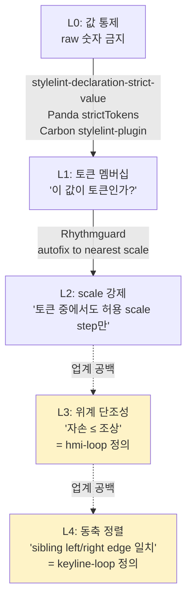

# Gestalt 위계 분석 — 외부 레퍼런스 합성

## TL;DR

- **de facto 표준 없음.** 업계는 "토큰 멤버십"(이 값이 토큰인가?) 한 칸 아래에서 멈춰 있다. "선택자 깊이 × 토큰값으로 단조 감소를 검증"하는 도구는 정적·런타임 모두 0건.
- 우리 `hmi-loop` (selector depth × spacing monotonicity)는 **업계 공백을 메우는 신규 레이어**. 가장 가까운 선례는 Rhythmguard(평면 scale 강제) — 위계 개념 없음.
- 학계도 마찬가지. AIM(Aalto Interface Metrics)은 grid quality·white space만 잰다. **"Recursive Proximity" / "hierarchy monotonicity"는 학술 용어로 부재**, 프로젝트 자체 명명.
- 결론: 따라갈 표준 없음 → 우리 정의가 곧 1차 기준. 외부에서 빌릴 부분은 (1) stylelint AST 추출 패턴, (2) Carbon devtools 형태의 런타임 overlay 골격뿐.

## Why — 왜 이 질문이 지금 중요한가

audit-hmi.mjs가 이미 골격으로 깔려 있고, hmi-loop·keyline-loop 스킬도 정의돼 있는데 "외부에 따라갈 게 있으면 거기에 맞추자"가 자연 반응. 실제 조사 결과 **따라갈 표준이 없음**이 확정되면, 프로젝트는 자체 정의를 1차 기준으로 굳히고 그 위에 stylelint AST·Carbon devtools 같은 인프라 패턴만 차용하는 전략으로 바로 갈 수 있다.

## How — 표준/관행이 멈춘 위치

업계는 L1~L2까지만 도구화. L3·L4는 "디자이너가 눈으로 본다 + Chromatic/Percy 픽셀 diff로 회귀만 잡는다"가 사실상 표준.

## What — 외부에 실재하는 도구

### 정적 (lint)

| 도구 | 검사 범위 | 위계 단조성? |
|---|---|---|
| `stylelint-declaration-strict-value` | 토큰 멤버십 | ❌ |
| `carbon-design-system/stylelint-plugin-carbon-tokens` | margin/padding/gap 토큰 | ❌ 멤버십만 |
| `Kong/design-tokens` stylelint plugin | 토큰 사용 | ❌ |
| Atlassian `stylelint-design-system` | 토큰 사용 | ❌ |
| Rhythmguard | scale step 강제 + autofix | ❌ 평면 |
| `stylelint-selector-max-depth` | 셀렉터 깊이 | ❌ 깊이만, 값 무관 |
| Panda CSS `strictTokens` | 타입 레벨 | ❌ 멤버십만 |

**핵심**: 깊이 lint와 토큰 lint가 별도로 존재할 뿐, **둘을 곱한 도구는 없다.**

### 런타임 (DOM measurement)

- Chrome DevTools — Inspect Spacing, CSS Overview, Layout overlays. **단일 요소만**.
- VisBug, Pesticide, Storybook addon-measure — outline·distance 표기. 위계 개념 없음.
- Chromatic / Percy — 픽셀 diff, 의미적 위계 모름.
- Carbon Devtools / Material Theme Inspector(Android) — 토큰 사용 통계, 위계 단조 검증 없음.

### Visual regression

Polaris, Carbon, Atlassian 모두 Chromatic/Percy. **invariant이 아니라 회귀 감지** — 의도적으로 위계가 깨졌어도 그게 "스냅샷이 됐다"면 통과.

## What-if — 우리 프로젝트에 적용하면

따라갈 표준이 없다는 것 = **우리 정의가 곧 1차**. 의사결정 단순해짐:

1. **L1·L2는 외부 차용** — Carbon stylelint plugin 패턴으로 토큰 멤버십·scale은 stylelint에 위임. 직접 안 만든다.
2. **L3 (hmi-loop)는 자체 구현** — `audit-hmi.mjs`가 이미 selectorDepth·isDescendantSelector 보유. 위계 토큰(`hierarchy.atom < section < surface < shell`)을 number로 환원해 단조 위반을 리포트하는 스크립트로 완성.
3. **L4 (keyline-loop)는 런타임 전용** — 정적으로 cascade 결과 못 봄. `apps/finder/src/devtools/SpacingOverlay.tsx` 위에 sibling edge 측정 모드 추가가 최단 경로.
4. **L3 결과를 `apps/finder/src/devtools/checks.ts` invariant로 등록** — CI 게이트화.

외부에서 가져올 것: Carbon `stylelint-plugin-carbon-tokens`의 AST 패턴, Storybook `addon-measure`의 hover 측정 UI 골격. 그 외엔 자체 정의가 표준.

## 흥미로운 이야기

- 게슈탈트는 1920년대 베를린학파부터 100년 된 개념인데 **UI 자동 검증으로는 한 번도 단조성 형태로 환원된 적이 없음**. AIM(Aalto, Oulasvirta 그룹)이 figure-ground·grid quality·visual complexity를 정량화했지만 proximity는 "binary segmentation cue"로만 다뤘다 — VIPS(Cai 2003) 같은 페이지 segmenter 입력. "depth가 깊을수록 gap이 작아야 한다"라는 형태의 수식은 학계에 없다.
- Rhythmguard 저자(Petri Lähdelmä)가 dev.to에 쓴 글이 가장 가까운 선례인데, 본인도 "scale step 위반"까지만 잡는다고 명시. 위계 차원으로 확장은 미완.
- de facto 부재의 이유 추정: 디자인시스템 진영은 "토큰만 쓰면 일관성은 자동" 가정으로 충분히 보였고(Chromatic이 잔여 회귀를 잡으니까), 위계 invariant 형태로 명시화할 동기가 약했다. 우리 프로젝트는 LLM이 부품을 조립할 때의 일관성을 강제해야 해서 invariant이 필수가 됐다 — 이게 차별점.

## Insight

**프로젝트 규약과의 정합성: 일치(공백 보완)**. 외부 표준이 부재하므로 충돌 가능성 자체가 없다.

한 줄 결론: **따라갈 표준 없음 → audit-hmi.mjs 확장으로 정적 트랙을 먼저 완성하고, SpacingOverlay 위에 keyline 런타임 트랙을 형제로 얹는 것이 합리적 1차.** 외부에서 빌릴 것은 stylelint AST 패턴(Carbon)과 hover overlay UX(Storybook addon-measure)뿐, 검증 의미론은 자체 정의.

## 출처

- [stylelint-declaration-strict-value](https://www.npmjs.com/package/stylelint-declaration-strict-value) — 토큰 멤버십 강제, scale 위계 X
- [stylelint-plugin-carbon-tokens](https://github.com/carbon-design-system/stylelint-plugin-carbon-tokens) — spacing/layout 토큰 검증, 멤버십만
- [Atlassian stylelint-design-system](https://atlassian.design/components/stylelint-design-system) — DS 토큰 lint
- [Rhythmguard (dev.to)](https://dev.to/petrilahdelma/enforcing-your-spacing-standards-with-rhythmguard-a-custom-stylelint-plugin-1ojj) — scale step 강제 + autofix, 평면
- [Panda CSS strictTokens](https://panda-css.com/docs/theming/tokens) — 타입 레벨 토큰 멤버십
- [stylelint-selector-max-depth](https://www.npmjs.com/package/stylelint-selector-max-depth) — 셀렉터 깊이 lint, 값 무관
- [Chrome DevTools CSS](https://developer.chrome.com/docs/devtools/css/) — 런타임 단일 요소 측정
- [GoogleChromeLabs/ProjectVisBug](https://github.com/GoogleChromeLabs/ProjectVisBug) — 비주얼 측정 overlay
- [Storybook addon-measure](https://storybook.js.org/addons/@storybook/addon-measure) — hover box model
- [carbon-design-system/carbon-devtools](https://github.com/carbon-design-system/carbon-devtools) — DS 자체 런타임 inspector 사례
- Aalto Interface Metrics — interfacemetrics.aalto.fi (Oulasvirta 외, grid quality·white space)
- VIPS (Cai et al. 2003) — DOM-tree 기반 페이지 segmentation, proximity = binary cue
