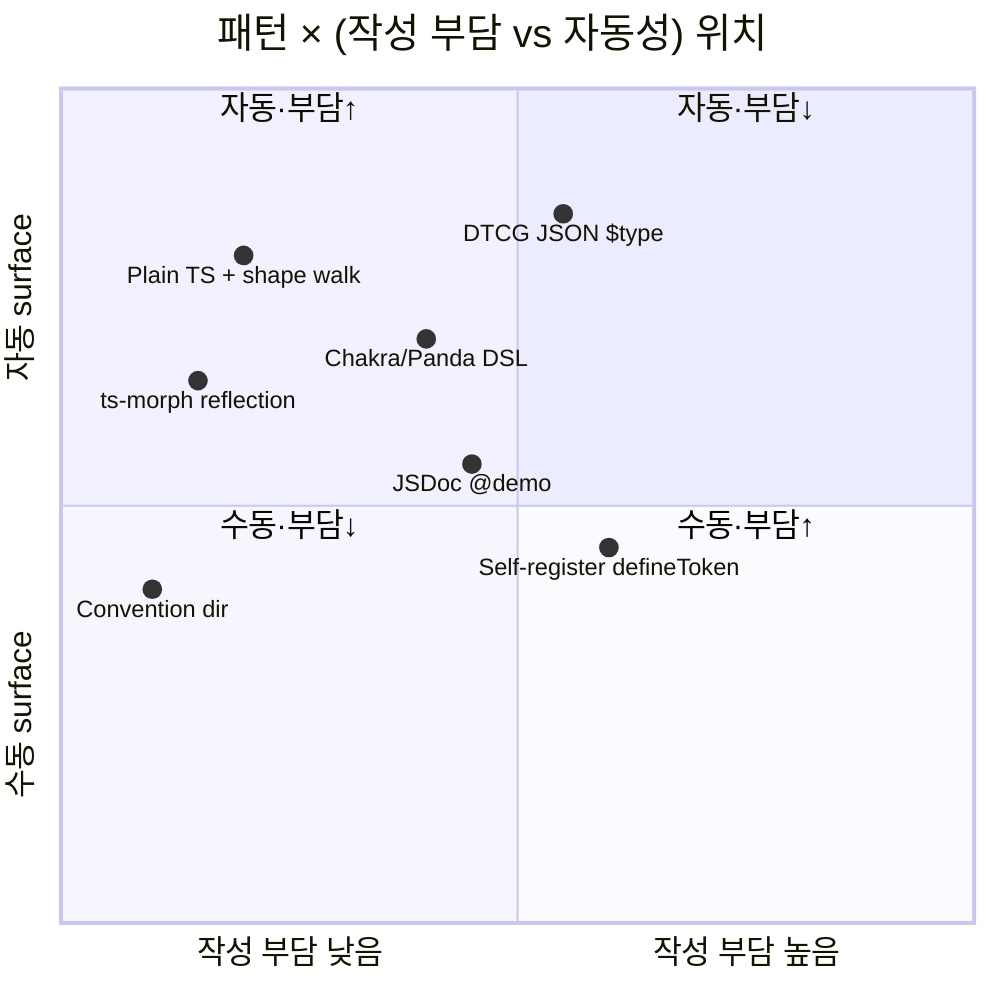
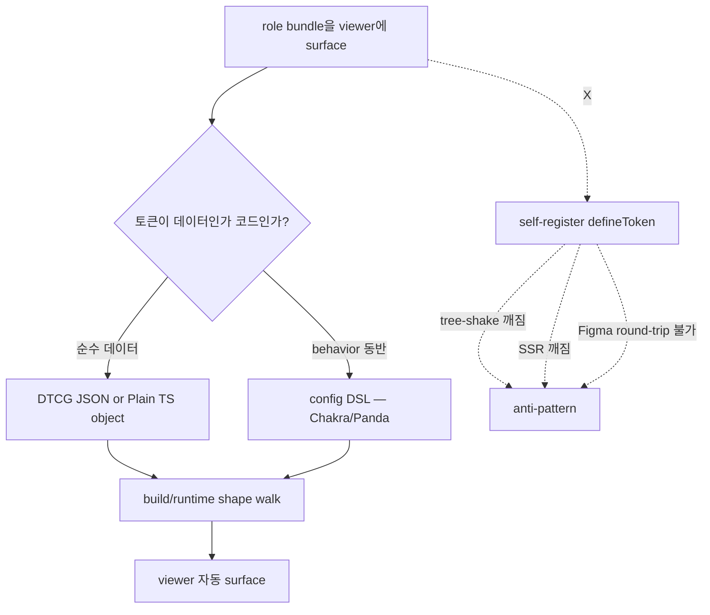

# Token bundle auto-surfacing — 업계 de facto

## TL;DR

업계는 **plain TS/JSON 객체 + build·runtime 시점 shape walk** 한 가지로 강하게 수렴했다. W3C DTCG `$type/$value` 스펙(2024 Editor's Draft)이 lingua franca. **자기등록 `defineToken({...})` registry는 명시적 anti-pattern** — Chakra v3·Panda·Tamagui 등 *비슷해 보이는* 함수도 모두 build-time DSL이지 side-effect registry가 아니다 (이유: tree-shake·SSR·Figma round-trip 깨짐). 우리 직관(`defineRoleMap` 자기등록)과 업계 결론이 충돌하므로 plain object + introspection 으로 가는 것이 표준.

## Why — 왜 이 질문이 지금 중요한가

`type.*` role bundle을 foundations에 옮긴 직후, Canvas viewer가 자동 픽업하는 메커니즘 결정 시점. 우리 프로젝트엔 이미 `defineScreen`·`definePage`·`defineFlow` 등 **앱 레벨 register 컨벤션**이 있어 같은 패턴을 token 레이어에도 자연스럽게 직관했다 (`defineRoleMap`). 하지만 **token 레이어와 app 레이어는 같은 레지스트리 패턴이 통하는지** — 외부 검증 필요.

## How — 6 패턴과 업계 채택률





| # | 패턴 | 채택 사례 | 점유 |
|---|------|---------|------|
| 1 | **DTCG JSON ($type/$value)** | Adobe Spectrum, Shopify Polaris, Tokens Studio, Style Dictionary v4 | 🔥 dominant (multi-platform) |
| 2 | **Plain TS object + shape walk** | Open Props, Radix Themes, Mantine | 🔥 dominant (TS-only) |
| 3 | **Config DSL** (`defineTokens` 컴파일대상) | Chakra v3, Panda CSS, Tamagui, Stitches | 흔함 |
| 4 | **TS reflection (ts-morph)** | Vanilla Extract 일부 | 드묾 |
| 5 | **JSDoc @demo annotation** | Material Web (제한적) | 드묾 |
| 6 | **Self-register `defineToken`** | **0건** (no major DS) | ❌ anti-pattern |

## What — 구체 사례

### Adobe Spectrum — DTCG JSON

```json
// @adobe/spectrum-tokens
{
  "spacing": {
    "100": { "$value": "4px", "$type": "dimension" },
    "200": { "$value": "8px", "$type": "dimension" }
  }
}
```
build pipeline이 CSS·Swift·Kotlin 출력. viewer는 JSON 자체를 walk.

### Radix Themes — Plain TS object walk

```ts
// scales 그대로 export, docs site는 typeof + Object.entries로 surface
export const blue = { blue1: '#fbfdff', blue2: '#f4faff', /* ... */ }
```

### Chakra v3 — config DSL (자기등록 ❌, build-time)

```ts
defineTokens.colors({
  brand: { 50: { value: '#...' } },  // ← 함수 호출이지만 plain object 반환
})
// PandaCSS build가 컴파일 → 정적 CSS + 타입
```
이름이 `defineTokens`라 self-register처럼 보이지만 **순수 함수, 사이드이펙트 없음**.

### "Self-register defineToken" — 사용 없음

GitHub·npm trends·DS 문서 어디에도 token 레벨 self-register 사례 없음. RFC 댓글에서 명시 거부 사유:
- **tree-shaking 불가** — import side-effect
- **SSR 비결정성** — 모듈 순서 의존
- **Figma round-trip 차단** — JSON으로 dump 불가
- **타입 추출 불가** — registry는 런타임 객체

## What-if — 우리 프로젝트 적용

| 길 | 권장도 | 이유 |
|----|-------|------|
| **A. plain TS + shape walk + 카테고리는 file path** | 🟢 표준 | 우리 `slot/size/type` 이미 이 형태. tokenGroups가 `audit.exports`에서 객체인지 추가 판정 한 줄. |
| B. DTCG JSON | 🟡 multi-platform 시 | iOS/Android 출력 필요 시 채택. 지금은 over-engineering. |
| C. `defineRoleMap` self-register | 🔴 거부 | 업계 0건, anti-pattern. tree-shake/SSR/JSON dump 모두 깨짐. `defineScreen`은 app 레이어라 다른 이야기 — token은 데이터. |
| D. JSDoc @demo annotation | 🟡 보조 | sample renderer 힌트로는 OK. 자동 surface는 shape walk가 우선. |

**결론**: A. 우리가 직관한 `defineRoleMap` 레지스트리는 **업계 검증으로 거부됨**.

## 흥미로운 이야기

DS 토큰의 "registry vs data" 논쟁은 2019~2021 Stitches·styled-components 시대에 끝났다. styled-components의 `ThemeProvider`가 런타임 컨텍스트로 토큰을 주입하던 시대 → Vanilla Extract·Panda·CSS variables 시대로 넘어오며 **"토큰은 정적 데이터"** 컨센서스 확립. CSS-in-JS가 zero-runtime으로 회귀한 이유 중 하나가 이 토큰 정적성 요구.

W3C DTCG는 2020 결성 → 2024 Editor's Draft. 토큰을 *vendor-neutral 직렬화 가능 데이터* 로 못박는 작업. Figma·Tokens Studio·Style Dictionary가 모두 한 형식으로 수렴 중.

흥미로운 outlier: **Tamagui `createTokens`** — 이름은 "create"지만 인자를 받아 정규화된 객체를 반환하는 순수 함수. "함수 호출 = 등록"이 아닌 "함수 호출 = 타입 보강된 데이터 빌더". 같은 패턴이 Chakra·Panda·Stitches 모두에 등장 — **함수 형태와 registry 패턴은 다르다**는 미묘한 구분.

## Insight

업계 결론: **token은 데이터다, 코드가 아니다.** 따라서 register 패턴 거부, shape walk 채택.

**프로젝트 규약 정합성**:
- 일치 ✅: plain TS object 형태(`slot`/`size`/`type`)는 이미 표준
- 부분 충돌 ⚠️: `defineScreen`/`definePage` register 패턴은 **app 레이어 라우팅용**이라 정당. 같은 모양을 token에 적용하는 건 layer 혼동 — token은 정적 데이터, route는 동적 등록 대상.
- 해야 할 일: **plan B (shape introspection)** 로 진행. `tokenGroups.ts`가 객체 export도 통과시키고, `TokenCard`가 typeof 분기. 어노테이션·registry 도입 ❌.

CLAUDE.md "추구미 — 검증 가능한 선언(declaration)" 와도 정합 — token이 *데이터*면 선언이고, *register 호출*이면 명령. Occam·declaration-first 원칙이 이미 답을 가리키고 있었다.

## 출처

- [W3C Design Tokens Format](https://tr.designtokens.org/format/) — `$type`/`$value` 스펙
- [Style Dictionary v4](https://styledictionary.com/info/dtcg/) — DTCG 채택
- [Adobe Spectrum tokens](https://github.com/adobe/spectrum-tokens) — DTCG JSON 기반
- [Shopify Polaris tokens](https://polaris.shopify.com/tokens/color) — JSON metadata + description
- [Open Props](https://open-props.style) — plain CSS custom props + 객체 walk
- [Radix Themes color](https://www.radix-ui.com/themes/docs/theme/color) — plain TS object 채택
- [Chakra v3 tokens](https://chakra-ui.com/docs/theming/tokens) — `defineTokens` config DSL
- [Panda CSS tokens](https://panda-css.com/docs/theming/tokens) — config compile to static
- [Tamagui createTokens](https://tamagui.dev/docs/core/configuration) — 순수 함수
- [Vanilla Extract themes](https://vanilla-extract.style/documentation/api/create-theme/) — TS contract
- [Mantine theme](https://mantine.dev/theming/theme-object/) — TS object walk
- [Material 3 tokens](https://m3.material.io/styles/color/system/tokens) — CSS props from JSON
- [Carbon themes](https://carbondesignsystem.com/guidelines/tokens/overview/) — directory convention
