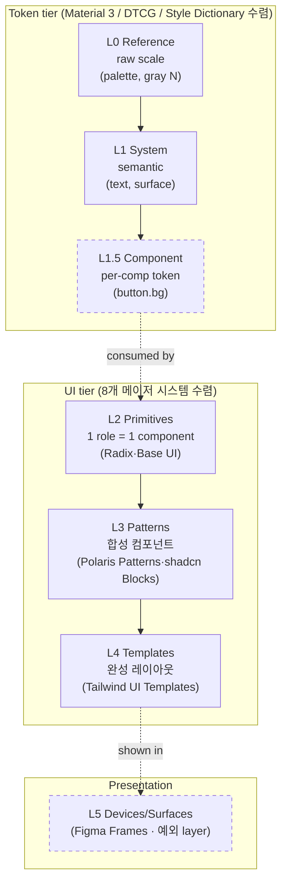

# Canvas 분류 체계 — de facto 수렴 패턴

## TL;DR

- **우리 4단(L0 Palette → L1 Foundations → L2 Atoms → L3 Composed)은 atomic design 의 변형이 아니라 Material 3 의 token tier (ref/sys/comp) 계보다.** Frost 의 atoms·molecules·organisms 5단은 더 이상 de facto 가 아니다 — 메이저 시스템 8개 모두 자체 분류를 쓴다.
- **빠진 칸: L1.5 Component tokens (M3 `comp` tier).** 다만 우리는 의도적으로 component token 을 만들지 않는 길(semantic-only)을 택했다. 누락이 아니라 *선언적 거부* — Radix Colors / Base UI 와 같은 흐름.
- **L2/L3 안 세분화 여지 큼.** Foundations 11 도메인 중 control·recipes·primitives 3개는 표준에서 components/patterns 쪽으로 빠져 있어야 할 것이 foundations 폴더에 섞임. parts 어휘는 Radix anatomy(슬롯)와 충돌. recipes 어휘는 업계 의미(스타일 빌더)와 어긋남(우리는 layout templates).
- **권장 보강**: 4단을 6단으로 — L0 Palette → L1 Foundations(토큰만) → L1.5 Component tokens(빈 칸 명시) → L2 Primitives(현 atoms) → L3 Patterns(현 composed의 합성 컴포넌트) → L4 Templates/Recipes(현 ui/recipes의 layout) → L5 Devices/Surfaces.

## Why — 왜 지금 묻는가

canvas 는 ds 어휘를 한 장에 수렴시키는 SSOT viewer 다(Memory `project_canvas_intent`). 분류가 평탄하면:
- LLM 이 새 부품을 어디에 둘지 결정할 때 자유도가 커진다 (CLAUDE.md 추구미 §1: "선언으로 묶을 수 있는 건 전부 선언").
- fs 계층(`ui/<tier>/<group>/<file>`) 의 풍부함이 viewer 에 안 보이면 "있는데 안 보이는" silent regression.
- 오늘 발견한 갭: depth-3 폴더(`ui/6-overlay/command/*`, `ui/recipes/sidebar/*`) 와 `content/*` 가 canvas 에서 빠져있었음 → glob 보강으로 일부 해소했으나, **상위 분류가 4단인 한 새 컨셉이 들어오면 또 막힘**.

## How — de facto 수렴 구조



점선 = 일부 진영만 채택. Component token tier 는 Radix/Base UI 진영이 거부, Devices layer 는 Storybook viewport·Figma frames 외 메이저 사례 없음.

### 수렴 근거 요약

| Tier | 표준 명명 | 출처 | 우리 매핑 |
|------|----------|------|-----------|
| L0 | ref / global / base | Material 3, Spectrum, SLDS | `palette/` |
| L1 | sys / alias / common | Material 3, Spectrum, SLDS, DTCG | `foundations/` |
| L1.5 | comp / component | Material 3, Spectrum, SLDS | **(의도적 비움)** |
| L2 | Primitives / Components | Radix, Base UI, Ark, shadcn | `ui/0-primitives ~ 5-display` |
| L3 | Patterns / Blocks / 합성 | Polaris, shadcn, Atlassian | `ui/patterns/`, `ui/6-overlay/command/`, `content/` |
| L4 | Templates / Layouts | Tailwind UI, Material | `ui/recipes/` (이름만 어긋남) |
| L5 | Devices/Surfaces (예외) | Figma, HIG | `devices/` |

### Atomic Design 의 위상

Frost 5단(atoms·molecules·organisms·templates·pages)은 **mental model 로만 살아있고 catalog taxonomy 로는 폐기 흐름**. Material/Polaris/Atlassian/Carbon/Spectrum/Ant/Fluent/HIG **8개 시스템 모두 자체 분류**를 쓴다 — atoms/molecules 폴더로 publish 하는 메이저 디자인 시스템은 0개. Storybook 도 2023+ 가이드에서 atomic 권장 폐기, "도메인 그루핑" 권장.

## What — 우리 4단 매핑 + 갭

### 현재 → 표준 매핑

| 현재 canvas | de facto | 비고 |
|-------------|----------|------|
| L0 Palette (raw) | M3 `ref` | 일치 |
| L1 Foundations | M3 `sys` + 일부 비-token | **혼재**: color/typography/iconography/layout/motion/spacing/elevation/shape/state(8개)는 표준, control/recipes/primitives(3개)는 비표준 위치 |
| L2 Atoms (1 role=1 component) | Radix Primitives | 일치 (이름만 atoms → primitives 권장) |
| L3 Composed | Patterns + Templates + Devices 혼합 | **3중 혼재**: `ui/patterns`(합성 컴포넌트=Patterns), `ui/recipes`(layout=Templates), `devices`(Surfaces) 세 다른 층이 한 lane rank 에 평행 |

### 어휘 충돌 / 어긋남

1. **`ds/parts` vs Radix `parts`** — Radix anatomy 의 parts 는 컴포넌트 *내부 슬롯*(Root·Trigger·Content). 우리 `ui/parts` 는 *공유 빌딩블록*(Card·Heading). 동명이의. 표준 어휘는 후자에 "primitives" 또는 "components".
2. **`ui/recipes` vs Panda/Chakra `recipes`** — 업계 recipes 는 `cva` 류 *스타일 빌더 함수*. 우리 recipes 는 *layout 합성*(holyGrail·sidebarAdmin·masterDetail). 표준 어휘로는 **templates** 또는 **layouts**.
3. **`ui/patterns` vs Polaris `patterns`** — Polaris patterns 는 *행동/콘텐츠 가이드*(Empty states·Date picking). 우리 patterns 는 *합성 컴포넌트*(BarChart·StatCard·MessageBubble). 표준 어휘로는 shadcn **blocks** 또는 그냥 합성 components.

## What-if — 적용 시나리오

### 시나리오 A — 최소 변경 (이름만 정렬)

canvas 페이지/lane 라벨만 표준 어휘로:
- "Atoms" → "Primitives"
- "Composed" → 페이지 자체를 "Composed"로 두되, 내부 lane 을 **Patterns**(현 ui/patterns + content + ui/6-overlay/command), **Templates**(현 ui/recipes), **Devices**(현 devices) 3 sub-lane 으로 분리
- foundations 폴더의 control/recipes/primitives 는 그대로 두되 canvas 에서 별도 sub-section "(non-token foundations)" 로 라벨링

→ 비용 작음, 구조 변경 0, 어휘 정렬만.

### 시나리오 B — 분류 6단 승격 (canvas 페이지 추가)

```
L0 Palette
L1 Foundations (토큰만)
L1.5 Component tokens — "intentionally empty (semantic-only)" 명시
L2 Primitives
L3 Patterns
L4 Templates
L5 Devices
```

PageDivider 4개 → 6개. atomLanes/composedLanes split → 더 정밀한 split.

→ 비용 중간, ds 폴더 일부 이동(control/recipes/primitives → ui/), 메모리 갱신 필요.

### 시나리오 C — fs ↔ canvas 1:1 (오늘 진행 중)

오늘 변경(depth-3 subgroup 보존)을 더 끌고 가서 **canvas 가 fs 폴더 트리를 그대로 미러링**. lane = 폴더, sub-lane = sub-folder. 분류 체계는 폴더 자체에 맡김.

→ 비용 큼, Canvas 컴포넌트 본격 트리 nav 도입. 분류 결정을 fs 로 위임 — 어휘는 폴더명이 SSOT.

## 흥미로운 이야기

**Atomic Design 이 실제로는 "왜 안 살아남았나"** — Brad Frost 자신도 atoms/molecules 경계가 모호함을 인정했고, 후속 글에서 *thinking model* 로 격하시켰다. 메이저 디자인 시스템은 *기능적 묶음*(Polaris: Actions·Forms·Layout·Feedback·Navigation)이 사용자에게 더 잘 검색된다는 걸 발견했다. atoms/molecules 가 "이 컴포넌트는 어떤 단(tier)이지?" 를 매번 묻게 만드는 반면, 기능 묶음은 "내가 지금 뭘 하려고 하지?"에 답한다. 우리 ui/<tier>(0-primitives~8-layout)는 전자(tier) + 후자(role)의 하이브리드 — Ant Design 6축에 Atlassian/Polaris/Radix 어휘 수렴이 깔린 형태(Memory `project_ui_tier_label_mapping`).

**Material 3 가 component token 을 살린 이유** — Material 1~2 는 alias 만으로 충분하다고 봤지만 Material You(2021+)에서 *user-driven theming* 이 들어오면서 component 별로 dynamic color 가 다르게 풀려야 했다. 그래서 `comp.filled-button.container.color` 같은 깊은 path 가 부활. Radix Colors 는 반대로 *theming 은 semantic 까지만* 으로 자르고 component token 을 거부 — "어휘를 닫고 component 가 필요한 만큼만 semantic 을 늘려라". 우리 CLAUDE.md §5 "vocabulary closed" + §6 "widget 은 semantic 만 import" 는 후자 노선이다.

## Insight

**한 줄 결론**: 우리 4단은 token tier(M3 ref/sys) + UI tier(Primitives/Composed)의 압축 버전이다. de facto 와 비교해 *없는 것*은 없고, *섞여있는 것*만 있다 — 특히 L3 Composed 안에 Patterns·Templates·Devices 세 다른 층이 한 페이지에 평행 나열되는 게 가장 큰 표면적 부족.

**프로젝트 규약과의 정합성**:
- ✅ **추구미 §1·§5·§6 와 정합** — 표준 분류 도입은 "선언으로 묶기" + "어휘 닫기" 와 같은 방향.
- ⚠️ **부분 충돌**: 시나리오 B 의 ds 폴더 이동(control/recipes/primitives → ui/)은 Memory `project_palette_vs_foundations` (palette/foundations 2층) 의 "foundations 안에 mixin/recipes 도 둔다"는 결정과 일부 충돌. 시나리오 A(이름·sub-lane만 정렬) 는 충돌 0.
- ✅ **시나리오 C 와 시너지** — 오늘 진행한 depth-3 subgroup 보존이 시나리오 C 의 첫 단계. Canvas 가 fs 트리를 미러링하면 분류 결정 자체가 폴더 구조로 위임되어 추구미 §1 "선언" 가장 강하게 지키는 길.

**권고 — 단계적 보강 (auto 모드 컨텍스트에서 즉시 적용 가능한 것 한정)**:
1. **L3 Composed 안 sub-lane 3분할** — `Patterns` (ui/patterns + content + 합성 overlay), `Templates` (ui/recipes), `Devices`. PageDivider 추가 X, lane 라벨/순서만 정렬. → 시나리오 A.
2. **lane 라벨 어휘 정정** — `Atoms` → `Primitives`(M3/Radix 표준), `ui/recipes` → `Layout templates`(업계 의미 일치). → 시나리오 A.
3. **L1.5 Component tokens 패널** — 한 줄짜리 빈 패널 "*Component tokens — intentionally empty (semantic-only, Radix Colors 노선)*" 추가하여 표준과의 거리를 자체 문서화.
4. (보류) 시나리오 B/C 는 폴더 이동 + Canvas 트리 nav 도입이라 별도 PR.

## 출처

### Token tier
- [Material Design 3 — Design tokens overview](https://m3.material.io/foundations/design-tokens/overview) — ref/sys/comp 3단 정의
- [Adobe Spectrum — Design tokens](https://spectrum.adobe.com/page/design-tokens/) — global/alias/component
- [Salesforce SLDS — Design tokens](https://www.lightningdesignsystem.com/design-tokens/) — base/common/component
- [DTCG W3C — Design Tokens Format Module](https://www.designtokens.org/tr/drafts/format/) — alias 체인 표준
- [Style Dictionary](https://styledictionary.com/info/tokens/) — category/type/item
- [Figma Variables](https://help.figma.com/hc/en-us/articles/15145852043927) — Primitive/Semantic/Component 3 collection 권장

### Foundations 도메인
- [Material 3 Foundations](https://m3.material.io/foundations) · [Polaris Foundations](https://polaris.shopify.com/foundations) · [Atlassian Foundations](https://atlassian.design/foundations)
- [Carbon Guidelines](https://carbondesignsystem.com/guidelines/) · [Spectrum Design Principles](https://spectrum.adobe.com/page/design-principles/)
- [Apple HIG Foundations](https://developer.apple.com/design/human-interface-guidelines/foundations) · [Ant Design Spec](https://ant.design/docs/spec/introduce) · [Fluent 2](https://fluent2.microsoft.design/)

### 컴포넌트 어휘
- [Radix Primitives](https://www.radix-ui.com/primitives/docs/overview/introduction) — anatomy parts
- [Polaris Patterns](https://polaris.shopify.com/patterns) · [Atlassian Patterns](https://atlassian.design/patterns) · [Material Components](https://m3.material.io/components)
- [shadcn/ui Blocks](https://ui.shadcn.com/blocks) · [Tailwind UI Components](https://tailwindui.com/components)
- [Panda CSS Recipes](https://panda-css.com/docs/concepts/recipes) · [Park UI](https://park-ui.com/)
- [Storybook Viewport addon](https://storybook.js.org/docs/essentials/viewport) — devices 처리
