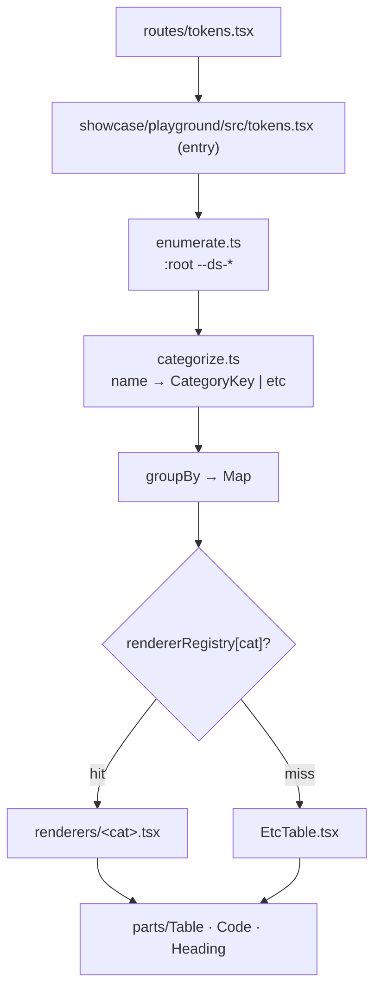

# `/tokens` Renderer Dispatch — PRD

> **Discussion**: 이 세션 위쪽 /discuss 결과 (D안 — 속성 기반 Renderer Dispatch + ETC 폴백)
> **산출물 유형**: 리팩토링 (showcase)
> **규모 추정**: 신규 8 (categorize + 7 renderer + EtcTable), 수정 2 (`tokens.tsx` 본체, 필요 시 `_category.ts` 보강), 재사용 5 (parts/Table·Code·Heading·Section + foundations.tsx 패턴)

## §0 요구사항 (from discuss)

- ⑪ 해결: `:root --ds-*` enumerate → `name → category` → `rendererRegistry[category]` lookup → hit 시 전용 렌더러, miss 시 `EtcTable`. 신규 lane = 두 파일 1줄씩 추가 (OCP).
- ⑦ 제약: SSOT 유지 (수동 매핑 ❌) · classless · `data-ds` 만 · `parts/Table` 사용 (raw `<table>` ❌) · 기존 메타포 *재배치만*, 로직 신규 작성 ❌.
- ⑧ 보유 자산:
  - `showcase/playground/src/foundations.tsx` (217줄) — 같은 dispatch 골격이 **이미 가동 중**. /tokens 는 이 패턴을 그대로 평행이동.
  - `tokens/foundations/<cat>/_category.ts` × 16 + `category-meta.ts` `defineCategory`. canvas 가 `import.meta.glob` 으로 자동 수집 중 (`showcase/canvas/src/tokenGroups.ts`).
  - `parts/Table·Code·Heading` + 기존 740줄의 `ColorSwatchGrid·TypeSpecimen·SpacingLadder·RadiusMorph·ElevationStack·MotionDemo·ContainerBars` 7개 메타포.
- ⑫ 부작용 분담: 함수형 export(hairline mixin·focusRing 등)는 `/foundations` 전담 — 본 PRD 범위 밖.

## §1 책임 분해

| # | 책임 | 파일 경로 | 레이어 | 기존/신규 | 의존 |
|---|------|----------|-------|----------|------|
| 1 | `:root` 의 모든 `--ds-*` var 를 `getComputedStyle` 로 수집 | `showcase/playground/src/tokens/enumerate.ts` | showcase 유틸 | 신규 (740줄에서 추출) | — |
| 2 | varName → CategoryKey \| 'etc' 분류 (prefix longest-first) | `showcase/playground/src/tokens/categorize.ts` | showcase 유틸 | 신규 | — |
| 3 | Color renderer (swatch grid + semantic pair) | `showcase/playground/src/tokens/renderers/color.tsx` | showcase 부품 | 신규 — 기존 `ColorSwatchGrid`+`SemanticPairs` 이동 | 1,2 |
| 4 | Typography renderer (specimen + weight) | `showcase/playground/src/tokens/renderers/typography.tsx` | showcase 부품 | 신규 — `TypeSpecimen`+`WeightSpecimen` 이동 | 1,2 |
| 5 | Spacing renderer (hierarchy ladder + pad scale) | `showcase/playground/src/tokens/renderers/spacing.tsx` | showcase 부품 | 신규 — `SpacingLadder`+`PadScale` 이동 | 1,2 |
| 6 | Radius renderer | `showcase/playground/src/tokens/renderers/radius.tsx` | showcase 부품 | 신규 — `RadiusMorph` 이동 | 1,2 |
| 7 | Elevation renderer | `showcase/playground/src/tokens/renderers/elevation.tsx` | showcase 부품 | 신규 — `ElevationStack` 이동 | 1,2 |
| 8 | Motion renderer | `showcase/playground/src/tokens/renderers/motion.tsx` | showcase 부품 | 신규 — `MotionDemo` 이동 | 1,2 |
| 9 | Container renderer | `showcase/playground/src/tokens/renderers/container.tsx` | showcase 부품 | 신규 — `ContainerBars` 이동 | 1,2 |
| 10 | Generic ETC table (parts/Table 기반) | `showcase/playground/src/tokens/EtcTable.tsx` | showcase 부품 | 신규 (foundations.tsx `EtcRenderer` 시그니처와 동형) | 1 |
| 11 | Renderer registry (CategoryKey → FC) | `showcase/playground/src/tokens/renderers/index.ts` | showcase 데이터 | 신규 | 3-9 |
| 12 | 본체 — enumerate → groupBy(categorize) → dispatch | `showcase/playground/src/tokens.tsx` | showcase 라우트 entry | 수정 (740 → ~80줄) | 1,2,10,11 |

### 탐색 증거

- `Glob`: `showcase/playground/src/tokens*` → `tokens.tsx` (740줄) 단일.
- `Glob`: `showcase/playground/src/foundations*` → `foundations.tsx` (217줄, dispatch 가동 중 — §1 의 모범).
- `Grep`: `import.meta.glob` → `canvas/tokenGroups.ts:22 ('@p/ds/tokens/foundations/*/_category.ts')` 사용 중 — 카테고리 SSoT 자동 수집 패턴 확립.
- `Read`: `tokens/foundations/*/_category.ts` × sample 2건 — `defineCategory({ label, standard })` 형태 16개 lane (color·typography·spacing·shape·state·motion·elevation·control·layout·iconography·zIndex·opacity·focus·sizing·breakpoint + css). 신규 6 lane 도 이미 `_category.ts` 보유.
- `parts/Table·Heading·Code` 재사용 가능 (`packages/ds/src/index.ts:147,149,151,155`).

### 검증

- 1파일 1책임 ✓ (각 renderer 는 한 카테고리)
- 의존 칼럼 비순환 ✓ (1·2 → 3-10 → 11 → 12 단조)
- 레이어 정방향 ✓ (utils → renderers → registry → entry)
- placeholder 없음 ✓

**완성도**: 🟢

## §2 Contract

### `tokens/enumerate.ts`

```ts
export type RootVar = { name: string; value: string }

/**
 * `:root` 의 `--ds-*` var 를 `getComputedStyle` 로 enumerate.
 * @invariant 반환 배열은 name 사전순. 빈 값(--ds-*: ;)은 제외.
 */
export function enumerateRootVars(): RootVar[]
```

### `tokens/categorize.ts`

```ts
export type CategoryKey =
  | 'color' | 'typography' | 'spacing' | 'shape' | 'state'
  | 'motion' | 'elevation' | 'iconography' | 'control' | 'layout'
  | 'zIndex' | 'opacity' | 'focus' | 'sizing' | 'breakpoint'

export type CategorizedVar = RootVar & { category: CategoryKey | 'etc' }

/**
 * varName → CategoryKey | 'etc'. prefix longest-first 매칭.
 * @invariant 동일 var 가 두 카테고리에 동시에 속하지 않는다 (단일 분류).
 */
export function categorize(name: string): CategoryKey | 'etc'

export function categorizeAll(vars: RootVar[]): Map<CategoryKey | 'etc', CategorizedVar[]>
```

### `tokens/renderers/<category>.tsx` (3-9 공통 시그니처)

```ts
import type { CategorizedVar } from '../categorize'

export type CategoryRendererProps = { tokens: CategorizedVar[] }

/** 기존 740줄에서 inline JSX 를 *그대로 이동*. 로직 신규 작성 금지. */
export const ColorRenderer: React.FC<CategoryRendererProps>
// (typography·spacing·radius·elevation·motion·container 동일 시그니처)
```

### `tokens/EtcTable.tsx`

```ts
/**
 * 미매칭 var 들을 generic 표로. parts/Table 사용 (raw <table> ❌).
 * @invariant columns: name · value (computed). 정렬: name 사전순.
 */
export const EtcTable: React.FC<CategoryRendererProps>
```

### `tokens/renderers/index.ts`

```ts
import type { CategoryKey } from '../categorize'
import type { CategoryRendererProps } from './color'

export const rendererRegistry: Partial<Record<CategoryKey, React.FC<CategoryRendererProps>>> = {
  color:      ColorRenderer,
  typography: TypographyRenderer,
  spacing:    SpacingRenderer,
  shape:      RadiusRenderer,    // shape 카테고리에 radius 가 들어 있음
  elevation:  ElevationRenderer,
  motion:     MotionRenderer,
  layout:     ContainerRenderer, // container = layout 카테고리의 일부
}
/* registry 에 없는 카테고리(zIndex·opacity·focus·sizing·breakpoint·iconography·control·state)
 * 는 자동으로 EtcTable 폴백 — OCP closed. */
```

**완성도**: 🟢

## §3 WHY

740줄 inline JSX 는 *카테고리가 위치로 표현된 상태* — 신규 lane 마다 본체 수정. /foundations 가 이미 dispatch 로 풀어둔 문제이고, /tokens 는 그 평행이동이면 충분. registry 에 entry 가 있는 카테고리는 풍부하게, 없으면 정직한 표 — 모든 토큰이 *반드시* 보이되 대표는 잘 보이는 구조. 신규 6 lane(z-index·opacity·focus·sizing·breakpoint·border)이 `_category.ts` 만 있고 전용 renderer 없으면 자동 ETC 로 떨어져 *비대칭이 사라진다*.

## §4 HOW



## §5 WHAT (의존 순서)

### W1. enumerate.ts (§1.1)

**의존**: —
**파일**: `showcase/playground/src/tokens/enumerate.ts`

```ts
export type RootVar = { name: string; value: string }

export function enumerateRootVars(): RootVar[] {
  if (typeof window === 'undefined') return []
  const style = getComputedStyle(document.documentElement)
  const out: RootVar[] = []
  for (let i = 0; i < style.length; i++) {
    const name = style[i]
    if (!name.startsWith('--ds-')) continue
    const value = style.getPropertyValue(name).trim()
    if (value) out.push({ name, value })
  }
  return out.sort((a, b) => a.name.localeCompare(b.name))
}
```

**검증**: dev 서버 `/tokens` 로딩 시 `enumerateRootVars().length > 50` 콘솔 sanity.

### W2. categorize.ts (§1.2)

**의존**: W1
**파일**: `showcase/playground/src/tokens/categorize.ts`

```ts
import type { RootVar } from './enumerate'

export type CategoryKey =
  | 'color' | 'typography' | 'spacing' | 'shape' | 'state'
  | 'motion' | 'elevation' | 'iconography' | 'control' | 'layout'
  | 'zIndex' | 'opacity' | 'focus' | 'sizing' | 'breakpoint'

export type CategorizedVar = RootVar & { category: CategoryKey | 'etc' }

// longest-first — `--ds-on-accent` 가 `--ds-on` 보다 먼저 매칭되지 않도록
const PREFIX_TABLE: Array<[string, CategoryKey]> = [
  // typography
  ['--ds-text-', 'typography'], ['--ds-leading-', 'typography'],
  ['--ds-weight-', 'typography'], ['--ds-font-', 'typography'],
  // spacing
  ['--ds-space', 'spacing'], ['--ds-pad-', 'spacing'], ['--ds-gap-', 'spacing'],
  // shape (radius·border·hairline)
  ['--ds-radius-', 'shape'], ['--ds-border-', 'shape'], ['--ds-hairline', 'shape'],
  // motion
  ['--ds-dur-', 'motion'], ['--ds-ease-', 'motion'],
  // elevation
  ['--ds-elev-', 'elevation'], ['--ds-shadow', 'elevation'],
  // z-index / opacity / focus / sizing / breakpoint
  ['--ds-z-', 'zIndex'],
  ['--ds-alpha-', 'opacity'], ['--ds-scrim', 'opacity'],
  ['--ds-focus-', 'focus'], ['--ds-ring-', 'focus'],
  ['--ds-size-', 'sizing'], ['--ds-control-h', 'sizing'],
  ['--ds-bp-', 'breakpoint'],
  // iconography / layout / state / control
  ['--ds-icon-', 'iconography'],
  ['--ds-container-', 'layout'], ['--ds-stage-', 'layout'],
  ['--ds-state-', 'state'],
  // color (마지막 — 가장 광범위 prefix `--ds-` 로 끝나서 fallthrough 위험)
  ['--ds-neutral-', 'color'], ['--ds-accent', 'color'], ['--ds-tone', 'color'],
  ['--ds-bg', 'color'], ['--ds-fg', 'color'], ['--ds-on-', 'color'],
  ['--ds-text', 'color'],   // 주의: '--ds-text-' 가 위에서 typography 로 먼저 잡힘
  ['--ds-surface', 'color'], ['--ds-muted', 'color'],
]

const SORTED = [...PREFIX_TABLE].sort(([a], [b]) => b.length - a.length)

export function categorize(name: string): CategoryKey | 'etc' {
  for (const [prefix, cat] of SORTED) if (name.startsWith(prefix)) return cat
  return 'etc'
}

export function categorizeAll(vars: RootVar[]): Map<CategoryKey | 'etc', CategorizedVar[]> {
  const m = new Map<CategoryKey | 'etc', CategorizedVar[]>()
  for (const v of vars) {
    const cat = categorize(v.name)
    const arr = m.get(cat) ?? []
    arr.push({ ...v, category: cat })
    m.set(cat, arr)
  }
  return m
}
```

**검증**: dev 서버 `/tokens` 콘솔 — `etc` bucket 크기 < 5 (있다면 누락 prefix). 0개면 모든 var 가 분류됨.

### W3-9. renderers/<category>.tsx (§1.3-9)

**의존**: W1·W2
**원칙**: 740줄 페이지의 7개 ReactNode (`ColorSwatchGrid`·`SemanticPairs`·`TypeSpecimen`·`WeightSpecimen`·`SpacingLadder`·`PadScale`·`RadiusMorph`·`ElevationStack`·`MotionDemo`·`ContainerBars`) 를 *그대로 이동*. 시그니처만 `({ tokens }: { tokens: CategorizedVar[] }) => JSX.Element` 로 통일.

```ts
// 예: renderers/color.tsx
import { ColorSwatchGrid, SemanticPairs } from './_color-internals'  // 이동된 ReactNode
import type { CategorizedVar } from '../categorize'

export const ColorRenderer = ({ tokens }: { tokens: CategorizedVar[] }) => (
  <>
    {ColorSwatchGrid}
    {SemanticPairs}
  </>
)
// tokens 인자는 추후 dynamic 화 여지 — 이번 라운드는 정적 ReactNode 이동만.
```

**검증**: 시각 회귀 — `/tokens` 스샷 대비 카테고리 섹션별 동일 (parts/Section heading 만 추가됨).

### W10. EtcTable.tsx (§1.10)

**의존**: W1
**파일**: `showcase/playground/src/tokens/EtcTable.tsx`

```ts
import { Table, Code } from '@p/ds'
import type { CategorizedVar } from './categorize'

export const EtcTable = ({ tokens }: { tokens: CategorizedVar[] }) => (
  <Table
    columns={[
      { key: 'name',  label: 'name' },
      { key: 'value', label: 'computed value' },
    ]}
    rows={tokens.map(t => ({
      name:  <Code>{t.name}</Code>,
      value: <Code>{t.value}</Code>,
    }))}
  />
)
```

**검증**: dev 서버 `/tokens` 에 ETC 섹션 렌더링 — 미매칭 토큰 0개여도 빈 표 안 나오게 entry 본체에서 `tokens.length > 0` gate.

### W11. renderers/index.ts (§1.11)

**의존**: W3-9
**파일**: `showcase/playground/src/tokens/renderers/index.ts`

```ts
import type { CategoryKey } from '../categorize'
import { ColorRenderer }      from './color'
import { TypographyRenderer } from './typography'
import { SpacingRenderer }    from './spacing'
import { RadiusRenderer }     from './radius'
import { ElevationRenderer }  from './elevation'
import { MotionRenderer }     from './motion'
import { ContainerRenderer }  from './container'

export const rendererRegistry = {
  color:      ColorRenderer,
  typography: TypographyRenderer,
  spacing:    SpacingRenderer,
  shape:      RadiusRenderer,
  elevation:  ElevationRenderer,
  motion:     MotionRenderer,
  layout:     ContainerRenderer,
} as const satisfies Partial<Record<CategoryKey, React.FC<{ tokens: CategorizedVar[] }>>>
```

### W12. tokens.tsx 본체 (§1.12)

**의존**: W1·W2·W10·W11
**파일**: `showcase/playground/src/tokens.tsx` (740 → ~80줄)

```tsx
/* eslint-disable react-refresh/only-export-components -- showcase 라우트: foundation 토큰 카탈로그. */
/**
 * /tokens — `:root --ds-*` SSOT viewer.
 *
 * 속성(prefix) → category → rendererRegistry dispatch.
 * 매칭 안 된 var 는 EtcTable 자동 폴백. 신규 lane = categorize.ts + (선택) renderers/index.ts 한 줄.
 * 함수형 export 는 /foundations 가 분담.
 */
import { useMemo } from 'react'
import { Heading, Section } from '@p/ds'
import { enumerateRootVars } from './tokens/enumerate'
import { categorizeAll, type CategoryKey } from './tokens/categorize'
import { rendererRegistry } from './tokens/renderers'
import { EtcTable } from './tokens/EtcTable'
import { CATEGORY_LABEL } from './tokens/labels'  // _category.ts 자동 수집

export function Tokens() {
  const groups = useMemo(() => categorizeAll(enumerateRootVars()), [])
  const entries = [...groups.entries()].sort(([a], [b]) =>
    String(a).localeCompare(String(b)),
  )
  return (
    <article>
      <Heading level={1}>Design Tokens</Heading>
      {entries.map(([cat, tokens]) => {
        const Renderer = cat === 'etc' ? EtcTable : (rendererRegistry as any)[cat] ?? EtcTable
        return (
          <Section key={String(cat)} heading={{ content: CATEGORY_LABEL[cat as CategoryKey] ?? 'ETC' }}>
            <Renderer tokens={tokens} />
          </Section>
        )
      })}
    </article>
  )
}
```

**검증**:
1. `npx tsc -b --noEmit` — 타입
2. `pnpm lint:ds:all` — 정적 규약
3. `/tokens` dev 스샷 — 카테고리 섹션 13~15개, ETC bucket 비어있거나 작음
4. 신규 카테고리 추가 시뮬: 임의 `--ds-test-foo: 1` 추가 → ETC 섹션에 자동 등장 (OCP 검증)

## §6 원칙 감시자 결과

- ✅ data-ds: layout primitive 만 — 본체에 `<article>` + `<Section>` (data-ds 미사용 — 카테고리 chrome 은 ds parts).
- ✅ classless: 셀렉터 추가 0건. 모든 표현은 parts/Table · parts/Section · parts/Heading · parts/Code.
- ✅ 있는 걸로: foundations.tsx dispatch 패턴 평행이동, 740줄 메타포 *이동*만 (신규 작성 ❌).
- ✅ no useMemo escape — 본체의 `useMemo` 1건은 enumerate 비용 (외부 호출) 캐싱이라 SRP 적합.
- ✅ placeholder 0건.
- ⚠️ `as any` 1건 (W12 dispatch line) — TS partial registry index lookup 회피용. registry 타입을 `Partial<Record<CategoryKey, FC>>` 로 좁히면 제거 가능하나 가독성 트레이드오프 — 구현 단계에서 결정.

---

**전체 완성도**: 🟢

## 자율 진행

§1·§2 🟢 → `/go` 로 자율 이관. W1→W12 위상정렬 그대로 단일 에이전트 순차 실행 권장 (병렬 dispatch 이득 < 한 파일 컨텍스트 비용). 검증 게이트 = `tsc -b` + `lint:ds:all` + `/tokens` dev 스샷.
