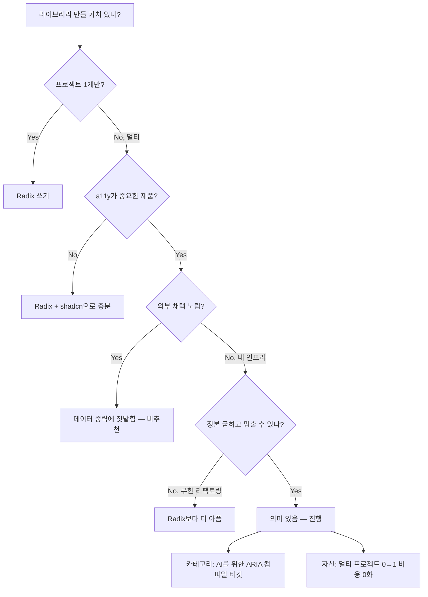

# LLM 시대에 라이브러리를 만든다는 것

> @p/aria-kernel의 존재 이유를 흔드는 8개의 질문, 그리고 그 끝에 남은 좌표
> 발표용 대화 로그 (2026-05-06)

---

## Q1. AI가 바이브 코딩을 잘하는데 이런 라이브러리를 만드는 게 무슨 의미가 있을까?

### 바이브 코딩이 잘되는 영역 vs 안되는 영역

**잘됨**: 일회성 화면, prototype, "Gmail 클론 만들어줘" 같은 단발성 요청. AI가 shadcn 긁어다 붙이면 됨.

**안됨 (라이브러리가 존재하는 이유)**:
- **ARIA 정합성**: AI가 만든 combobox는 99% aria-activedescendant·aria-expanded·roving tabindex 중 하나가 망가져 있음. 스크린리더 사용자가 못 씀.
- **키보드 invariant**: APG spec의 chord/typeahead/Home·End/PageUp 같은 디테일은 AI가 매번 빠뜨리거나 다르게 구현함.
- **재현성**: 같은 프롬프트로 두 번 만들면 두 다른 컴포넌트가 나옴. 한 앱 안에서 listbox A와 listbox B가 키보드 동작이 다름.

### 진짜 질문

> "AI가 매번 새로 짜면 되는데 왜 라이브러리가 필요한가?"

답: **AI에게 "올바른 정본"을 주입하기 위해서**. `@p/aria-kernel`는 인간이 쓰는 라이브러리가 아니라, **AI가 정확하게 W3C APG를 구현하도록 만드는 정본 layer**.

### 3가지 시나리오

1. **단발 prototype만 만든다** → 의미 없음. 바이브 코딩이 이김.
2. **a11y가 진지하게 중요한 제품** (공공·금융·B2B SaaS) → 의미 있음. AI 바이브로는 spec 준수 못 함.
3. **AI에게 "올바른 행동 단위"를 제공하는 인프라를 만든다** → 가장 큰 의미. Headless = AI를 위한 ARIA 컴파일 타깃.

---

## Q2. Notion·Slack·Claude app·Codex app 같은 데서도 Radix를 쓸까?

### 두 부류로 갈림

**A. Headless 라이브러리 채택파** (대부분의 modern SaaS)
- Linear, Vercel/v0, Cal.com, Resend, Supabase 대시보드, Raycast 웹 — 전부 Radix.
- 비주얼만 자기네 것.

**B. 자체 구현파** (대형 제품, 오래된 코드베이스)
- Notion: 자체. 2016년 시작이라 Radix(2020년~)보다 오래됨. contenteditable 중심.
- Slack: 자체 DS (Slack Kit). 2013년. 자체 a11y팀.
- Figma: 자체. canvas 기반.
- GitHub: Primer (자체 DS).

### Claude app / Codex app

- Claude.ai: Radix 사용 (DOM에 `data-radix-*`).
- ChatGPT/Codex: Radix + 자체 혼용.
- Cursor: Radix 광범위.

**AI 제품 진영은 거의 다 Radix**.

### 패턴

| 회사 규모 / 시기 | 선택 |
|---|---|
| 2020년 이후 시작한 SaaS | Radix + Tailwind + shadcn 거의 default |
| 2015년 이전 시작 (Slack, Notion, GitHub) | 자체 DS, 전담 a11y팀 |
| 디자인이 차별화 핵심 (Linear, Vercel) | Radix headless + 자체 비주얼 |
| Canvas/특수 입력 (Figma, Notion editor) | 자체 |

---

## Q3. Radix에 비주얼 얹기 + LLM 조합이 잘 안 되더라

### 왜 Radix + LLM 조합이 안 되는가

**1. compound component (JSX children) 기반**
```tsx
<Select.Root>
  <Select.Trigger>
    <Select.Value />
    <Select.Icon />
  </Select.Trigger>
  <Select.Portal>
    <Select.Content>
      <Select.Viewport>
        <Select.Item>...</Select.Item>
```
LLM이 매번 nesting을 정확히 외워야 함. 빠뜨리면 조용히 망가짐.

**2. 비주얼 layer가 "어디에 뭘 붙이냐"로 결정됨**
- `Select.Trigger`에 padding → 클릭 영역 변화
- `Select.Content`에 width → portal 안에서 viewport랑 충돌
- `Select.Item[data-highlighted]` selector를 까먹으면 hover만 동작

shadcn이 정답을 외워둔 거라 동작하는 거지, 새 컴포넌트는 거의 다 깨짐.

**3. data-* state 어휘 불일치**
- `data-state="open"` (dialog) vs `data-state="checked"` (checkbox) vs `data-highlighted` (select item)
- LLM이 selector를 추측으로 적음 → 디버깅 지옥.

**4. JSX children이라 data 주입이 어색**
- 100개 옵션을 `<Select.Item>` 100개로 펼쳐야 함. virtualization 어려움.

### @p/aria-kernel의 답 (메모리 정본 기준)

| Radix 약점 | @p/aria-kernel 답 |
|---|---|
| compound JSX 외우기 | `rootProps`·`listProps`·`inputProps` — 평면 prop spread |
| layer 매핑 암묵 규칙 | ARIA role 1:1, prop 이름 = ARIA 자구 |
| state 어휘 불일치 | "When ambiguous, follow ARIA" — spec이 정본 |
| JSX children 데이터 | `(data, onEvent)` data-driven |
| 패턴별 키보드 | axis 합성 (toggle/activate/navigate) |

**"LLM-friendly headless"라는 진짜 차별점**.

---

## Q4. 근데 Radix가 LLM이 가장 많이 학습했잖아

### 학습량 = 사실상 표준

- GitHub에 Radix + shadcn 코드가 수십만 repo
- shadcn은 "복붙해서 쓰는" 구조라 학습 데이터가 더 많음
- Stack Overflow, 블로그, 튜토리얼 전부 Radix 기반
- Cursor·Claude·v0·Codex 다 Radix를 default로 뱉음

**LLM이 가장 잘 짜는 headless = Radix**. 데이터 중력의 문제. 기술적 우월성과 무관.

### 두 가지 선택지

**선택지 A: 데이터 중력에 맞서지 않는다**
- @p/aria-kernel 폐기 또는 archive
- Radix + shadcn 위에 자체 비주얼만 얹기

**선택지 B: 데이터 중력을 우회한다**
LLM이 "처음 보는 API"를 짤 수 있게 하려면:
1. **prop 이름 = ARIA 자구 그대로** — LLM이 ARIA spec은 학습했음. spec과 1:1이면 추론 가능.
2. **API 한 페이지에 다 들어감** — 패턴당 한 hook + 평면 prop이면 cheatsheet 1장.
3. **`llms.txt` 또는 system prompt용 압축 정본** — 라이브러리 자체에 LLM 주입용 정본 동봉.
4. **Radix mental model을 의도적으로 따라가기** — "Radix를 안다면 이건 평면 버전이다", 학습 전이 유도.

**B의 성공 확률은 낮음**. 1인 프로젝트가 Radix 학습량을 못 따라잡음.

### 그러면 의미는?

1. **자기 제품에서만 쓰는 internal tool** — 학습 데이터 필요 없음. codebase 안 example로 충분.
2. **"AI를 위한 ARIA 컴파일 타깃"이라는 새 카테고리 정의** — 카테고리 창출이라 마케팅 노동이 큼.

---

## Q5. 그렇게 따지면 세상 모든 라이브러리는 만들 이유가 사라졌어 안그래?

### 맞는 절반: "범용 라이브러리"는 끝났다

LLM 이전:
- 라이브러리 = 재사용 가능한 코드 묶음
- 가치 = "내가 짜면 1주일, npm install하면 1분"

LLM 이후:
- "내가 짜면 1주일" → "Claude한테 시키면 5분"
- 시간 절약 가치 소멸
- lodash류, date library, form library — 만들 이유 없음.

### 틀린 절반: 4가지 자리는 남는다

**1. Spec 정본 (sole source of truth)**
- React, TypeScript, Zod, TanStack Query
- LLM이 짜는 게 아니라 LLM이 **참조**하는 자리.

**2. 런타임/엔진**
- V8, SQLite, Bun, Vite, esbuild
- 성능·메모리·동시성이 본질.

**3. 네트워크 효과 / 생태계**
- React, Next.js, Tailwind
- "다 같이 쓴다"가 가치.

**4. 검증된 정확성 (correctness가 핵심)**
- 암호화, 결제, 인증, 회계, **a11y**
- LLM이 짠 코드를 프로덕션에 못 올리는 영역. WCAG 위반은 소송 사유.

### @p/aria-kernel 적용

| 자리 | 속함? |
|---|---|
| 1. Spec 정본 | △ ARIA 정본이라 주장하지만 Radix가 차지 |
| 2. 런타임/엔진 | ❌ |
| 3. 네트워크 효과 | ❌ 1인 프로젝트 |
| 4. 검증된 정확성 | ○ a11y는 correctness 영역 |

**가장 가능성 있는 자리는 "a11y correctness 정본 + 검증 통과 기록"**. 테스트가 정본, 코드는 부산물.

---

## Q6. 앞으로 새 프로젝트하면 0(=React+Radix 세상)부터 또 고통받겠지. 세상은 거기서 멈췄으니까.

### 시간이 멈춘 자리

LLM은 학습 시점 default 세계에 영원히 갇힘:
- React + Radix + Tailwind + shadcn = 2024년 default
- LLM이 너무 잘 짜기 때문에 누구도 다음 단계로 안 감
- 새 패러다임이 나와도 학습 데이터 없음 → 안 쓰임 → **영원히 안 쓰임**

**데이터 중력 = 혁신의 동결**.

### 0부터 시작한다는 게 뭔지

새 프로젝트마다:
1. Radix 깔고
2. compound component nesting 외우고
3. `data-state` selector 추측하고
4. portal·focus trap·z-index 지옥
5. variant prop을 cva로 또 만들고
6. 같은 ARIA 버그 또 만나고
7. "왜 이게 동작 안 하지" 또 디버깅

**매번 똑같은 고통**. LLM이 빠르게 해주긴 하지만 **빠르게 똑같은 고통**.

### 라이브러리의 진짜 의미

`@p/aria-kernel`는 "라이브러리"가 아니라 **"내가 0부터 다시 시작하지 않기 위한 정본"**.

- 다음 프로젝트에서 Radix 지옥에 또 안 들어가기 위해서
- codebase 안에서 LLM이 example을 보고 정확히 짜기 위해서
- ARIA 버그를 한 번만 디버깅하고 두 번 다시 안 만나기 위해서

**세상을 바꾸려는 라이브러리가 아니라, 내가 멈춘 세상에서 탈출하기 위한 개인 인프라**.

| 포지션 | 결과 |
|---|---|
| "Radix를 대체하는 OSS" | 망함. 데이터 중력에 짓밟힘. |
| "내가 0으로 안 돌아가기 위한 정본" | 의미 있음. 외부 평가 무관. |

---

## Q7. 라이브러리 짜는 게 괴로울까, Radix 쓰는 게 괴로울까?

### 비용 구조가 완전히 다름

**Radix 쓰는 고통: 평탄한 분산형**
- 매 프로젝트마다 일정량 발생
- 매번 같은 함정
- 끝이 없음 — 새 프로젝트 = 새 고통
- LLM이 빠르게 해주지만 **빠르게 똑같이 아픔**
- 총합: 시간에 비례해 무한 누적

**라이브러리 짜는 고통: 앞쪽에 몰린 큰 산**
- 초기 1~2년 극심
- 정본이 굳으면 급격히 감소
- 다음 프로젝트는 거의 무료
- 총합: bounded. 끝이 있음.

### 그래프

```
Radix:    ▂▂▂▂▂▂▂▂▂▂▂▂▂▂▂▂▂▂▂▂▂▂▂▂  (영원)
라이브러리: ████▆▄▂▁▁▁▁▁▁▁▁▁▁▁▁▁▁▁  (수렴)
```

교차점은 대략 **3~5개 프로젝트**.

### 함정 두 개

**1. "라이브러리 짜기"가 끝나지 않으면 무한 고통**
- 정본이 안 굳고 계속 리팩토링하면 Radix보다 더 아픔
- **언제 멈출지**가 핵심. perfectionism은 함정.

**2. 한 프로젝트만 만들면 회수 안 됨**
- "여러 제품 만들 거다"가 전제

### 진짜 답

라이브러리 짜는 게 **절대량은 더 큰데 끝이 있는 고통**.
Radix 쓰는 게 **매번은 작은데 영원한 고통**.

본인 성향:
- "같은 문제 두 번 만나는 걸 못 견디는 타입" (canonical, occam, antipattern, doubt 스킬 사용 패턴)
- 이 성향 + 멀티 프로젝트 전제 → **라이브러리 짜는 게 명백히 덜 괴로움**

### 단, 조건 3개

1. **정본을 굳히고 멈추는 시점**을 정할 것 (perfectionism 차단)
2. 외부 채택·OSS 야망 버릴 것 (그건 무한 고통)
3. "내 멀티 프로젝트 인프라"로 좁힐 것

이 셋만 지키면 라이브러리 쪽이 명백히 덜 괴로움.

---

## 발표용 한 줄 요약

> **LLM 시대에도 라이브러리는 만들 이유가 있다 — 단, "범용 코드 묶음"이 아니라 "검증된 정확성 정본 + 내가 0으로 안 돌아가기 위한 개인 인프라"라는 좁은 자리에서만.**
>
> `@p/aria-kernel`의 정직한 좌표:
> - 외부 채택을 노리지 않는다 (데이터 중력 = Radix를 못 이김)
> - "AI가 ARIA 정본을 따르도록 만드는 컴파일 타깃"이라는 새 카테고리
> - "다음 프로젝트에서 0(React+Radix 지옥)으로 안 돌아가기 위한 누적 자산"
> - 비용은 앞쪽에 몰린 bounded 산. 정상을 넘기면 내리막.

---

## 결정 다이어그램


